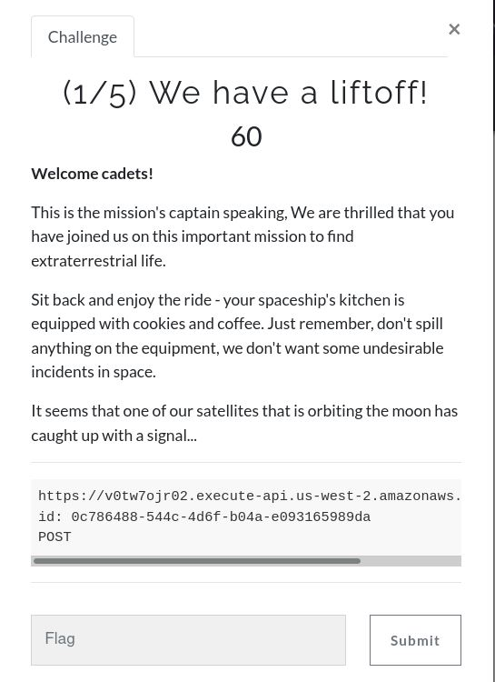
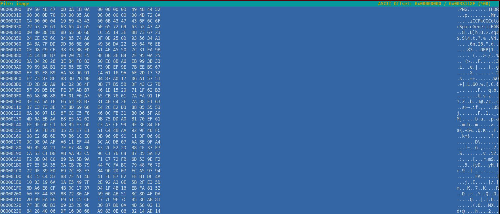

# CyberArk CTF 2021 - Writeups  - We have a liftoff!

Category: Innovation, Points: 60



>https://v0tw7ojr02.execute-api.us-west-2.amazonaws.com/fireitup
>id: 0c786488-544c-4d6f-b04a-e093165989da
>POST

# We have a liftoff! - Solution

According the description we need to send POST request to [https://v0tw7ojr02.execute-api.us-west-2.amazonaws.com/fireitup](https://v0tw7ojr02.execute-api.us-west-2.amazonaws.com/fireitup).

Let's send it using [BurpSuite](https://portswigger.net/burp):


As we can see we get the following text as response:
>Error handling your request, please check all required data

The error occured because we need to send also the id parameter (as described), We can add it as follow:
```HTTP
POST /fireitup HTTP/1.1
Host: v0tw7ojr02.execute-api.us-west-2.amazonaws.com
User-Agent: Mozilla/5.0 (Windows NT 10.0; rv:78.0) Gecko/20100101 Firefox/78.0
Accept: text/html,application/xhtml+xml,application/xml;q=0.9,image/webp,*/*;q=0.8
Accept-Language: en-US,en;q=0.5
Contente-Type: application/json
Accept-Encoding: gzip, deflate
DNT: 1
Connection: close
Upgrade-Insecure-Requests: 1
Content-Length: 45

{"id":"0c786488-544c-4d6f-b04a-e093165989da"}
``` 

Now we get the following response:


From the ```Content-Type``` header we understand it's should be ```image/png``` (Base64 encoded).

Let's save the response as file using ```curl```:
```console
┌─[evyatar@parrot]─[/cyberark/innovation/we_have_a_lifott]
└──╼ $ curl -i -s -k -X $'POST' \
    -H $'Host: v0tw7ojr02.execute-api.us-west-2.amazonaws.com' -H $'User-Agent: Mozilla/5.0 (Windows NT 10.0; rv:78.0) Gecko/20100101 Firefox/78.0' -H $'Accept: text/html,application/xhtml+xml,application/xml;q=0.9,image/webp,*/*;q=0.8' -H $'Accept-Language: en-US,en;q=0.5' -H $'Contente-Type: application/json' -H $'Accept-Encoding: gzip, deflate' -H $'DNT: 1' -H $'Connection: close' -H $'Upgrade-Insecure-Requests: 1' -H $'Content-Length: 45' \
    --data-binary $'{\"id\":\"0c786488-544c-4d6f-b04a-e093165989da\"}' \
    $'https://v0tw7ojr02.execute-api.us-west-2.amazonaws.com/fireitup' -o b64_image
```

At this step we need to edit ```b64_image``` file - Remove all HTTP headers and remove the last character.

Now, we are able to decode it as Base64:
```console
┌─[evyatar@parrot]─[/cyberark/innovation/we_have_a_lifott]
└──╼ $ cat b64_image | base64 -d > image
┌─[evyatar@parrot]─[/cyberark/innovation/we_have_a_lifott]
└──╼ $ file image 
image: data
```

Let's observe the file using ```hexeditor```:



We know that [PNG header](https://en.wikipedia.org/wiki/List_of_file_signatures) shoule be:
```
89 50 4E 47 0D 0A 1A 0A 
```

And as we can see our file header is:
```
89 50 4E 47 0D 0A 1B 0A
```

We can fix the PNG header using ```hexeditor``` - Change the 7th byte from ```1B``` to ```1A``` using ```hexeditor```.

And now we can see the PNG file:


Like that we can get the flag ```V3ryCl0seT0H0m3```.

