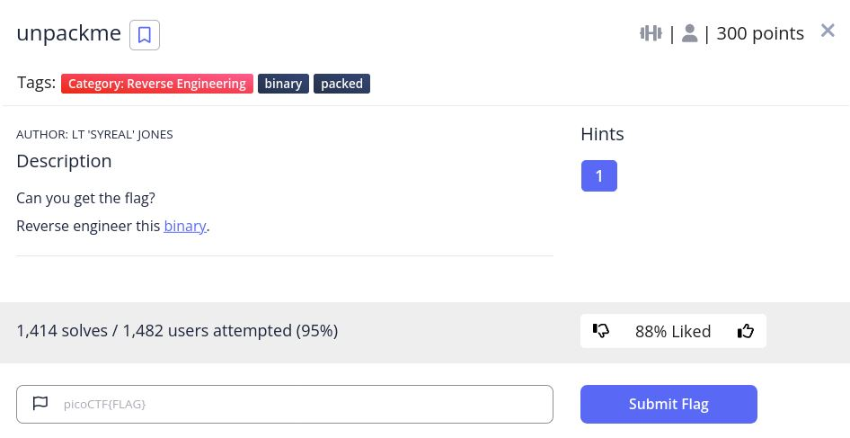

# unpackme - picoCTF 2022 - CMU Cybersecurity Competition
Reverse Engineering, 300 Points

## Description


 
## unpackme Solution

According to the challenge name we understand that the attached binary [unpackme-upx](./unpackme-upx) packed using [upx](https://upx.github.io/).

Let's unpack the binary using ```upx```:
```console
┌─[evyatar@parrot]─[/pictoctf2022/reverse_engineering/unpackme]
└──╼ $ upx -d unpackme-upx
                       Ultimate Packer for eXecutables
                          Copyright (C) 1996 - 2020
UPX 3.96        Markus Oberhumer, Laszlo Molnar & John Reiser   Jan 23rd 2020

        File size         Ratio      Format      Name
   --------------------   ------   -----------   -----------
   1002408 <-    379116   37.82%   linux/amd64   unpackme-upx

Unpacked 1 file.
```

By decompiling the unpacked binary using [Ghidra](https://github.com/NationalSecurityAgency/ghidra) we can see the following function:
```c

undefined8 main(void)

{
  long in_FS_OFFSET;
  int local_44;
  char *local_40;
  undefined8 local_38;
  undefined8 local_30;
  undefined8 local_28;
  undefined4 local_20;
  undefined2 local_1c;
  long local_10;
  
  local_10 = *(long *)(in_FS_OFFSET + 0x28);
  local_38 = 0x4c75257240343a41;
  local_30 = 0x30623e306b6d4146;
  local_28 = 0x3366353630486637;
  local_20 = 0x5f64675f;
  local_1c = 0x4e;
  printf("What\'s my favorite number? ");
  __isoc99_scanf(&DAT_004b3020,&local_44);
  if (local_44 == 0xb83cb) {
    local_40 = (char *)rotate_encrypt(0,&local_38);
    fputs(local_40,(FILE *)stdout);
    putchar(10);
    free(local_40);
  }
  else {
    puts("Sorry, that\'s not it!");
  }
  if (local_10 != *(long *)(in_FS_OFFSET + 0x28)) {
                    /* WARNING: Subroutine does not return */
    __stack_chk_fail();
  }
  return 0;
}
```

We can see we need to insert a number ```0xb83cb``` (```754635```) as input, Let's run it:
```console
┌─[evyatar@parrot]─[/pictoctf2022/reverse_engineering/unpackme]
└──╼ $ ./unpackme-upx 
What's my favorite number? 754635
picoCTF{up><_m3_f7w_ed7b0850}
```

And we get the flag ```picoCTF{up><_m3_f7w_ed7b0850}```.